# vue-shop-admin开发文档

## 一、项目介绍

http://shop.2yuecloud.com


## 二、创建项目

```shell
vue create vue-shop-admin
```


## 三、使用Git对项目进行版本控制

### 3.1 将本地仓库和远程仓库建立连接

```shell
git remote add origin git@github.com:YangMr/vue-shop-admin.git
```

### 3.2 将本地仓库的代码推送到远程仓库

```shell
git push origin main
```


## 四、代码规范

### 4.1 集成editorconfig配置

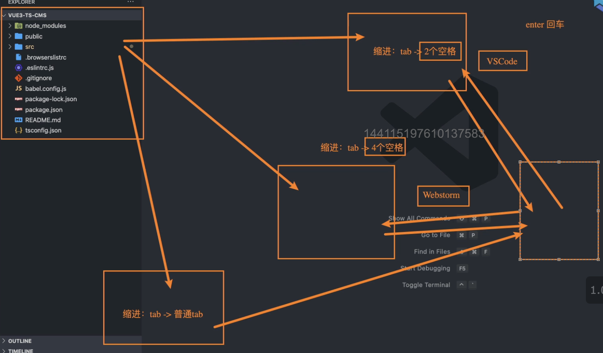

EditorConfig 有助于为不同 IDE 编辑器上处理同一项目的多个开发人员维护一致的编码风格。

```shell
# http://editorconfig.org

root = true

[*] # 表示所有文件适用
charset = utf-8 # 设置文件字符集为 utf-8
indent_style = space # 缩进风格（tab | space）
indent_size = 2 # 缩进大小
end_of_line = lf # 控制换行类型(lf | cr | crlf)
trim_trailing_whitespace = true # 去除行首的任意空白字符
insert_final_newline = true # 始终在文件末尾插入一个新行

[*.md] # 表示仅 md 文件适用以下规则
max_line_length = off
trim_trailing_whitespace = false
```

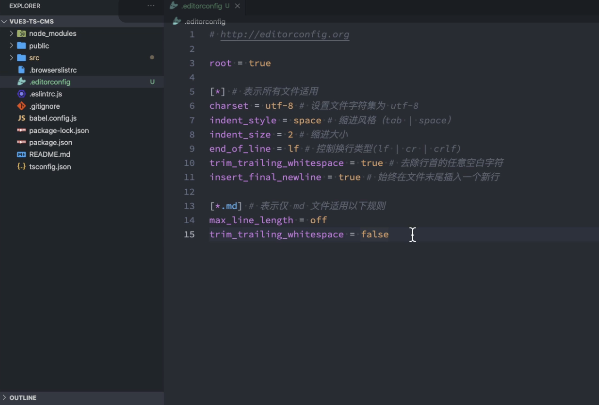

VSCode需要安装一个插件：EditorConfig for VS Code

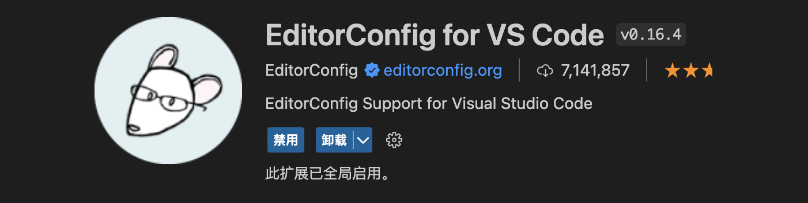


### 4.2 使用prettier工具

Prettier 是一款强大的代码格式化工具，支持 JavaScript、TypeScript、CSS、SCSS、Less、JSX、Angular、Vue、GraphQL、JSON、Markdown 等语言，基本上前端能用到的文件格式它都可以搞定，是当下最流行的代码格式化工具。

#### 4.2.1 VSCode需要安装prettier的插件

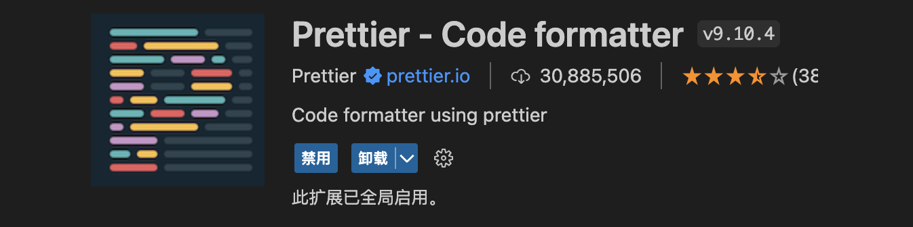

#### 4.2.2 安装prettier

```shell
npm install prettier -D
```

#### 4.2.3 配置.prettierrc文件：

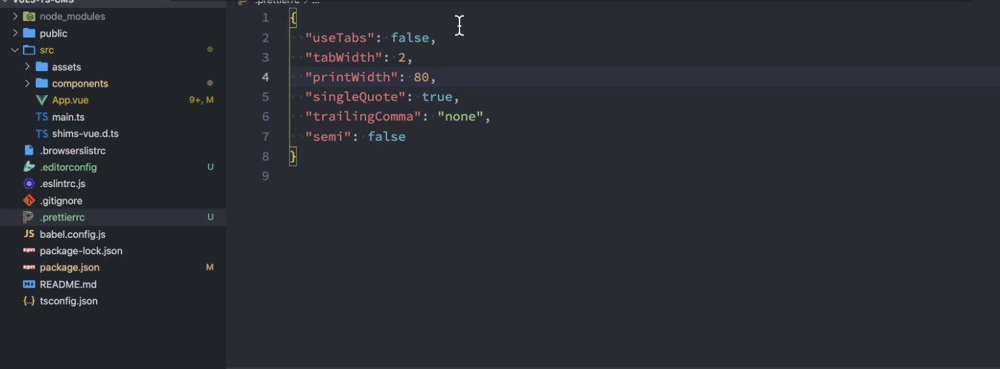

* useTabs：使用tab缩进还是空格缩进，选择false；
* tabWidth：tab是空格的情况下，是几个空格，选择2个；
* printWidth：当行字符的长度，推荐80，也有人喜欢100或者120；
* singleQuote：使用单引号还是双引号，选择true，使用单引号；
* trailingComma：在多行输入的尾逗号是否添加，设置为 `none`；
* semi：语句末尾是否要加分号，默认值true，选择false表示不加；

```json
{
  "useTabs": false,
  "tabWidth": 2,
  "printWidth": 80,
  "singleQuote": true,
  "trailingComma": "none",
  "semi": false
}
```

#### 4.2.4 创建.prettierignore忽略文件

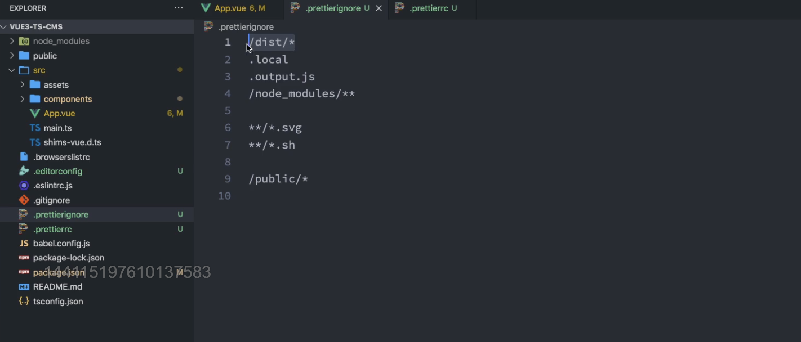

```shell
/dist/*
.local
.output.js
/node_modules/**

**/*.svg
**/*.sh

/public/*
```

#### 4.2.5 测试prettier是否生效

* 测试一：在代码中保存代码；
* 测试二：配置一次性修改的命令；

在package.json中配置一个scripts：

```json
"prettier": "prettier --write ."
```

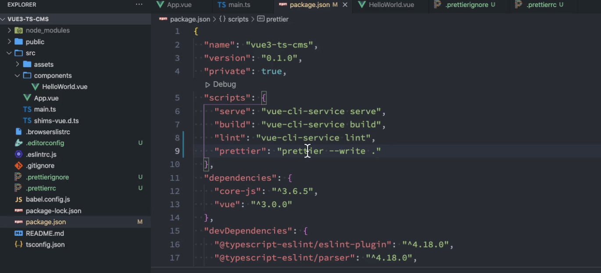

### 4.3 使用ESLint检测

#### 4.3.1 什么是eslint?

ESLint是一个开源的JavaScript代码检查工具，它可以帮助开发者在编写代码时发现和修复代码错误、维护一致的代码风格、避免潜在的问题等。ESLint支持在命令行中运行，也可以集成到各种开发工具中，如编辑器、集成开发环境等。通过配置ESLint，开发者可以自定义检查规则和限制，以满足项目的需求和约定.

#### 4.3.2 如何使用eslint?

1. 在前面创建项目的时候，我们就选择了ESLint，所以Vue会默认帮助我们配置需要的ESLint环境。

2. VSCode需要安装ESLint插件：

   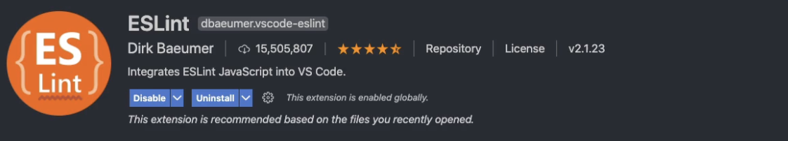

3. 解决eslint和prettier冲突的问题

   安装插件：（vue在创建项目时，如果选择prettier，那么这两个插件会自动安装）

   ```shell
   npm i eslint-plugin-prettier eslint-config-prettier -D
   ```

   添加prettier插件：

   ```shell
     extends: [
       "plugin:vue/vue3-essential",
       "eslint:recommended",
       "@vue/typescript/recommended",
       "@vue/prettier",
       "@vue/prettier/@typescript-eslint",
       'plugin:prettier/recommended'
     ],
   ```

### 4.4 git Husky和eslint

虽然我们已经要求项目使用eslint了，但是不能保证组员提交代码之前都将eslint中的问题解决掉了：

* 也就是我们希望保证代码仓库中的代码都是符合eslint规范的；

* 那么我们需要在组员执行 `git commit ` 命令的时候对其进行校验，如果不符合eslint规范，那么自动通过规范进行修复

那么如何做到这一点呢？可以通过Husky工具：

* husky是一个git hook工具，可以帮助我们触发git提交的各个阶段：pre-commit、commit-msg、pre-push

如何使用husky呢？

这里我们可以使用自动配置命令：

```shell
npx husky-init && npm install
```

这里会做三件事：

1. 安装husky相关的依赖：
   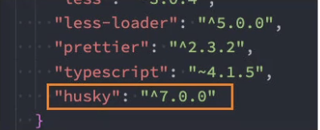
2. 在项目目录下创建 `.husky` 文件夹：

```shell
npx huksy install
```

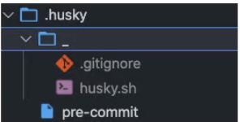

3. 在package.json中添加一个脚本：

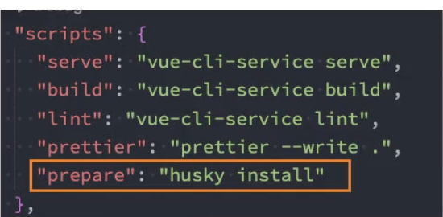

4. 接下来，我们需要去完成一个操作：在进行commit时，执行lint脚本：

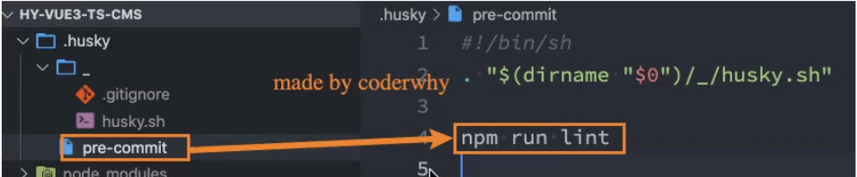

5. 这个时候我们执行git commit的时候会自动对代码进行lint校验。


### 4.5 git commit规范

#### 4.5.1 代码提交风格

通常我们的git commit会按照统一的风格来提交，这样可以快速定位每次提交的内容，方便之后对版本进行控制。

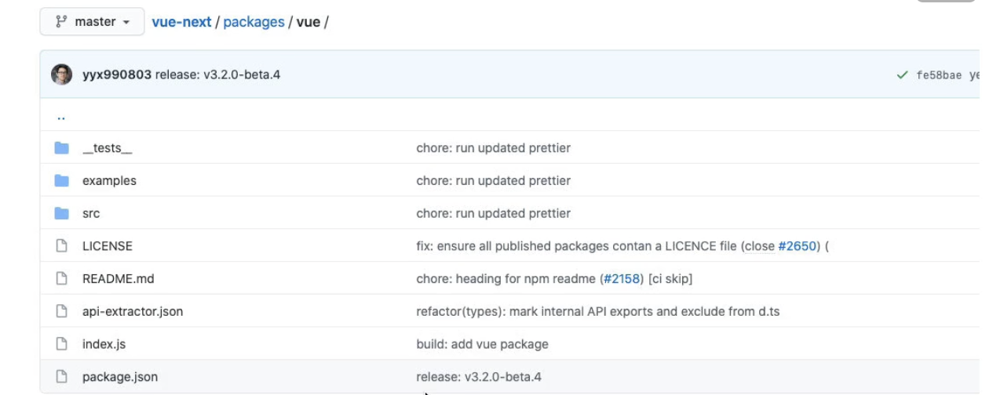

但是如果每次手动来编写这些是比较麻烦的事情，我们可以使用一个工具：Commitizen

- Commitizen 是一个帮助我们编写规范 commit message 的工具；

1. 安装Commitizen

```shell
npm install commitizen -D
```

2. 安装cz-conventional-changelog，并且初始化cz-conventional-changelog：

```
npx commitizen init cz-conventional-changelog --save-dev --save-exact
```

这个命令会帮助我们安装cz-conventional-changelog：

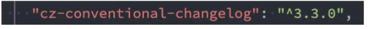

并且在package.json中进行配置：

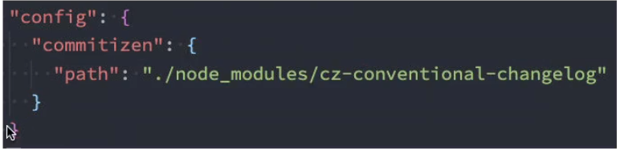

这个时候我们提交代码需要使用 `npx cz`：

- 第一步是选择type，本次更新的类型

| Type     | 作用                                                         |
| -------- | ------------------------------------------------------------ |
| feat     | 新增特性 (feature)                                           |
| fix      | 修复 Bug(bug fix)                                            |
| docs     | 修改文档 (documentation)                                     |
| style    | 代码格式修改(white-space, formatting, missing semi colons, etc) |
| refactor | 代码重构(refactor)                                           |
| perf     | 改善性能(A code change that improves performance)            |
| test     | 测试(when adding missing tests)                              |
| build    | 变更项目构建或外部依赖（例如 scopes: webpack、gulp、npm 等） |
| ci       | 更改持续集成软件的配置文件和 package 中的 scripts 命令，例如 scopes: Travis, Circle 等 |
| chore    | 变更构建流程或辅助工具(比如更改测试环境)                     |
| revert   | 代码回退                                                     |

- 第二步选择本次修改的范围（作用域）

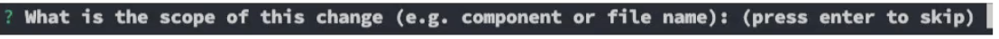

- 第三步选择提交的信息

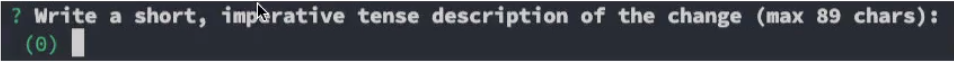

- 第四步提交详细的描述信息

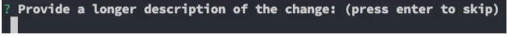

- 第五步是否是一次重大的更改

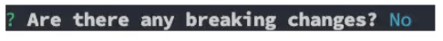

- 第六步是否影响某个open issue

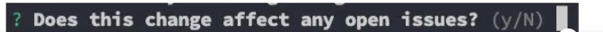

我们也可以在scripts中构建一个命令来执行 cz：

#### 4.5.2 代码提交验证

如果我们按照cz来规范了提交风格，但是依然有同事通过 `git commit` 按照不规范的格式提交应该怎么办呢？

- 我们可以通过commitlint来限制提交；

1. 安装 @commitlint/config-conventional 和 @commitlint/cli

```shell
npm i @commitlint/config-conventional @commitlint/cli -D
```

2. 在根目录创建commitlint.config.js文件，配置commitlint

```js
module.exports = {
  extends: ['@commitlint/config-conventional']
}
```

3. 使用husky生成commit-msg文件，验证提交信息：

```shell
npx husky add .husky/commit-msg "npx --no-install commitlint --edit $1"
```


## 五、第三方库集成

### 5.1  vue.config.js配置

vue.config.js有三种配置方式：

* 方式一：直接通过CLI提供给我们的选项来配置：
  * 比如publicPath：配置应用程序部署的子目录（默认是 `/`，相当于部署在 `https://www.my-app.com/`）；
  * 比如outputDir：修改输出的文件夹；
* 方式二：通过configureWebpack修改webpack的配置：
  * 可以是一个对象，直接会被合并；
  * 可以是一个函数，会接收一个config，可以通过config来修改配置；
* 方式三：通过chainWebpack修改webpack的配置：
  * 是一个函数，会接收一个基于  [webpack-chain](https://github.com/mozilla-neutrino/webpack-chain) 的config对象，可以对配置进行修改；

```javascript
const path = require('path')

module.exports = {
  // 方式一: 默认配置
  outputDir: './build',
  // 配置方式二: 将现有的配置合并到webpack中
  // configureWebpack: {
  //   resolve: {
  //     alias: {
  //       views: '@/views'
  //     }
  //   }
  // }
  // configureWebpack: (config) => {
  //   config.resolve.alias = {
  //     '@': path.resolve(__dirname, 'src'),
  //     views: '@/views'
  //   }
  // },
  // 配置方式三: 支持链式调用三
  chainWebpack: (config) => {
    config.resolve.alias.set('@', path.resolve(__dirname, 'src')).set('views', '@/views')
  }
}
```

### 5.2 vue-router集成

安装vue-router的最新版本：

```shell
npm install vue-router@next
```

创建router对象：

```javascript
import { createRouter, createWebHashHistory } from 'vue-router'
import { RouteRecordRaw } from 'vue-router'

const routes: RouteRecordRaw[] = [
  {
    path: '/',
    redirect: '/main'
  },
  {
    path: '/main',
    component: () => import('../views/main/main.vue')
  },
  {
    path: '/login',
    component: () => import('../views/login/login.vue')
  }
]

const router = createRouter({
  routes,
  history: createWebHashHistory()
})

export default router
```

引入router：

```javascript
import router from './router'

createApp(App).use(router).mount('#app')
```

在App.vue中配置跳转：

```html
<template>
  <div id="app">
    <router-link to="/login">登录</router-link>
    <router-link to="/main">首页</router-link>
    <router-view></router-view>
  </div>
</template>
```

### 5.3  vuex集成

安装vuex：

```shell
npm install vuex@next
```

创建store对象：

```ts
import { createStore } from 'vuex'

const store = createStore({
  state() {
    return {
      name: 'coderwhy'
    }
  }
})

export default store
```

安装store：

```ts
createApp(App).use(router).use(store).mount('#app')
```

在App.vue中使用：

```html
<h2>{{ $store.state.name }}</h2>
```

### 5.4 element-plus集成

Element Plus，一套为开发者、设计师和产品经理准备的基于 Vue 3.0 的桌面端组件库：

* 相信很多同学在Vue2中都使用过element-ui，而element-plus正是element-ui针对于vue3开发的一个UI组件库；
* 它的使用方式和很多其他的组件库是一样的，所以学会element-plus，其他类似于ant-design-vue、NaiveUI、VantUI都是差不多的；

安装element-plus

```shell
npm install element-plus
```

#### 5.4.1 全局引入

一种引入element-plus的方式是全局引入，代表的含义是所有的组件和插件都会被自动注册：

```js
import ElementPlus from 'element-plus'
import 'element-plus/lib/theme-chalk/index.css'

import router from './router'
import store from './store'

createApp(App).use(router).use(store).use(ElementPlus).mount('#app')
```

#### 5.4.2 按需引入

也就是在开发中用到某个组件对某个组件进行引入：

```vue
<template>
  <div id="app">
    <router-link to="/login">登录</router-link>
    <router-link to="/main">首页</router-link>
    <router-view></router-view>

    <h2>{{ $store.state.name }}</h2>

    <el-button>默认按钮</el-button>
    <el-button type="primary">主要按钮</el-button>
    <el-button type="success">成功按钮</el-button>
    <el-button type="info">信息按钮</el-button>
    <el-button type="warning">警告按钮</el-button>
    <el-button type="danger">危险按钮</el-button>
  </div>
</template>

<script lang="ts">
import { defineComponent } from 'vue'

import { ElButton } from 'element-plus'

export default defineComponent({
  name: 'App',
  components: {
    ElButton
  }
})
</script>

<style lang="less">
</style>
```


但是我们会发现是没有对应的样式的，引入样式有两种方式：

* 全局引用样式（像之前做的那样）；
* 局部引用样式；

1.首先你需要安装`unplugin-vue-components` 和 `unplugin-auto-import`这两款插件

```shell
npm install -D unplugin-vue-components unplugin-auto-import
```

2.配置vue.config.js

```js
const AutoImport = require('unplugin-auto-import/webpack')
const Components = require('unplugin-vue-components/webpack')
const { ElementPlusResolver } = require('unplugin-vue-components/resolvers')

module.exports = {
  // ...
  plugins: [
    AutoImport({
      resolvers: [ElementPlusResolver()],
    }),
    Components({
      resolvers: [ElementPlusResolver()],
    }),
  ],
}
```

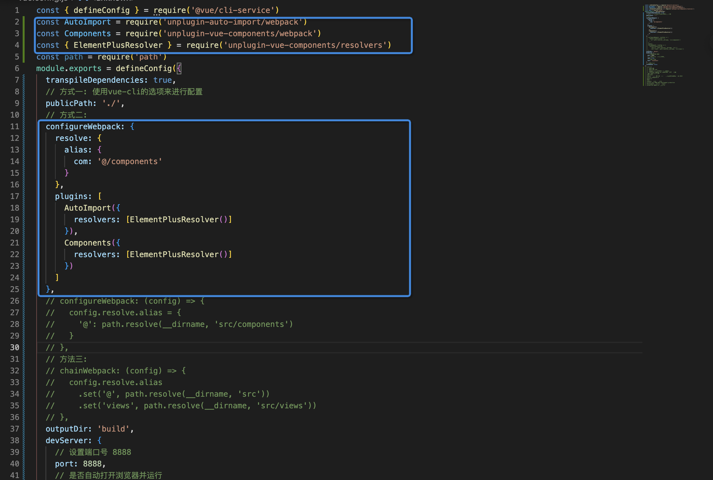


### 5.5 axios集成

#### 5.5.1 为什么要对axios进行封装?

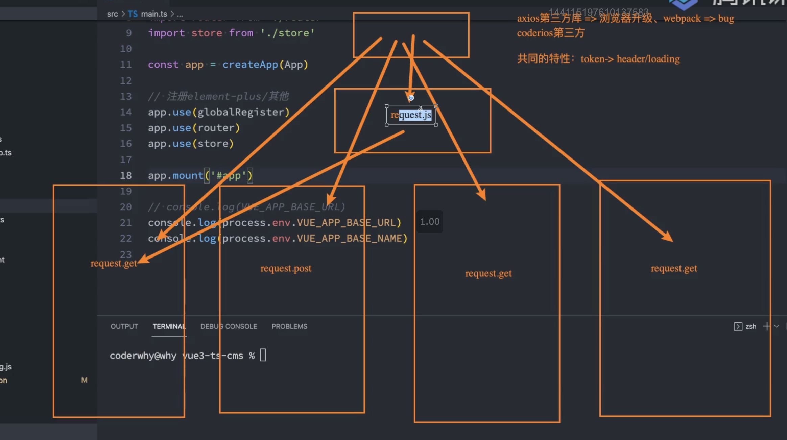

安装axios：

```shell
npm install axios
```

封装axios：

```ts
import axios, { AxiosInstance, AxiosRequestConfig, AxiosResponse } from 'axios'
import { Result } from './types'
import { useUserStore } from '/@/store/modules/user'

class HYRequest {
  private instance: AxiosInstance

  private readonly options: AxiosRequestConfig

  constructor(options: AxiosRequestConfig) {
    this.options = options
    this.instance = axios.create(options)

    this.instance.interceptors.request.use(
      (config) => {
        const token = useUserStore().getToken
        if (token) {
          config.headers.Authorization = `Bearer ${token}`
        }
        return config
      },
      (err) => {
        return err
      }
    )

    this.instance.interceptors.response.use(
      (res) => {
        // 拦截响应的数据
        if (res.data.code === 0) {
          return res.data.data
        }
        return res.data
      },
      (err) => {
        return err
      }
    )
  }

  request<T = any>(config: AxiosRequestConfig): Promise<T> {
    return new Promise((resolve, reject) => {
      this.instance
        .request<any, AxiosResponse<Result<T>>>(config)
        .then((res) => {
          resolve((res as unknown) as Promise<T>)
        })
        .catch((err) => {
          reject(err)
        })
    })
  }

  get<T = any>(config: AxiosRequestConfig): Promise<T> {
    return this.request({ ...config, method: 'GET' })
  }

  post<T = any>(config: AxiosRequestConfig): Promise<T> {
    return this.request({ ...config, method: 'POST' })
  }

  patch<T = any>(config: AxiosRequestConfig): Promise<T> {
    return this.request({ ...config, method: 'PATCH' })
  }

  delete<T = any>(config: AxiosRequestConfig): Promise<T> {
    return this.request({ ...config, method: 'DELETE' })
  }
}

export default HYRequest
```


## 六、项目基础配置

### 6.1 引入windicss工具库和配置

#### 6.1.1 访问windicss工具库官网

- 英文官网: https://windicss.org/

- 中文官网: https://cn.windicss.org/

#### 6.1.2  安装windicss

```shell
npm i -D windicss-webpack-plugin
```

#### 6.1.3 引入windicss插件

`vue.config.js`

```javascript
const { defineConfig } = require('@vue/cli-service')
const WindiCSSWebpackPlugin = require('windicss-webpack-plugin')
const AutoImport = require('unplugin-auto-import/webpack')
const Components = require('unplugin-vue-components/webpack')
const { ElementPlusResolver } = require('unplugin-vue-components/resolvers')

const path = require('path')
module.exports = defineConfig({
  transpileDependencies: true,
  // 方式一: 使用vue-cli的选项来进行配置
  publicPath: './',
  // 方式二:
  configureWebpack: {
    resolve: {
      alias: {
        com: '@/components'
      }
    },
    plugins: [
      new WindiCSSWebpackPlugin(),
      AutoImport({
        resolvers: [ElementPlusResolver()]
      }),
      Components({
        resolvers: [ElementPlusResolver()]
      })
    ]
  },
  // configureWebpack: (config) => {
  //   config.resolve.alias = {
  //     '@': path.resolve(__dirname, 'src/components')
  //   }
  // },
  // 方法三:
  // chainWebpack: (config) => {
  //   config.resolve.alias
  //     .set('@', path.resolve(__dirname, 'src'))
  //     .set('views', path.resolve(__dirname, 'src/views'))
  // },
  outputDir: 'build',
  devServer: {
    // 设置端口号 8888
    port: 8888,
    // 是否自动打开浏览器并运行
    open: true,
    // 设置主机名
    host: 'localhost'
  },
  // 关闭eslint
  lintOnSave: false
})
// 4.0 5.0
// 1. 处理跨域
// 2. 文件是干嘛的?
// 3. webpack --- 打包构建 --- nodejs
// 4. 同源策略? 域名、 协议、端口号  同源   跨域
// 跨域 只存在浏览器端
// 后端 没有
// nodejs   ---- 服务端  ---    第三方接口的数据  -》 接口
// vue-cli webpack5.0
// 不想用它
// 9999
// webpack   非常     vite
// process.env.NODE_ENV development production
// development 开发环境 开发模式
// production 生产环境 线上环境

```

`main.js`

```javascript
import 'windi.css'
```

注: 在`app.use(ElementPlus)`下面引入

#### 6.1.4 vscode中安装windicss插件

插件中搜索`windicss`


### 6.2 windicss小案例和@apply简化代码

#### 6.2.1 windicss小案例

1.1 先创建一个普通按钮

```vue
<button>按钮</button>
```

1.2 使用windicss提供的样式

设置按钮背景颜色

```vue
<button class=" bg-purple-500">按钮</button>
```

设置字体颜色

```vue
<button class=" bg-purple-500 text-indigo-50">按钮</button>
```

设置按钮间距

```vue
<button class=" bg-purple-500 text-indigo-50 px-4 py-2">按钮</button>
```

设置按钮圆角

```vue
<button class=" bg-purple-500 text-indigo-50 px-4 py-2 rounded">按钮</button>
```

鼠标移入颜色变深

```vue
<button class=" bg-purple-500 text-indigo-50 px-4 py-2 rounded hover:( bg-purple-900)">按钮</button>
```

鼠标移入颜色变深时希望有动画效果

```vue
<button class=" bg-purple-500 text-indigo-50 px-4 py-2 rounded transition-all hover:( bg-purple-900) ">按钮</button>
```

延长动画过渡时间

```vue
<button class=" bg-purple-500 text-indigo-50 px-4 py-2 rounded duration-150 transition-all hover:( bg-purple-900) ">按钮</button>
```

点击按钮时希望有轮廓

```vue
<button class=" bg-purple-500 text-indigo-50 px-4 py-2 rounded duration-150 transition-all hover:( bg-purple-900) focus:(ring-8)">按钮</button>
```

设置点击按钮时轮廓颜色

```vue
<button class=" bg-purple-500 text-indigo-50 px-4 py-2 rounded duration-150 transition-all hover:( bg-purple-900) focus:(ring-8 ring-yellow-500)">按钮</button>
```

#### 6.2.2 抽离所有类名

剪切刚才定义的所有类名, 重新定一个类名为`btn`

```vue
<button class="btn">按钮</button>
```

在style中使用`@apply`方法抽离类名

```css
<style>
.btn{
  @apply bg-purple-500 text-indigo-50 px-4 py-2 rounded duration-150 transition-all hover:( bg-purple-900) focus:(ring-8 ring-yellow-500);
}
</style>
```

在浏览器中预览

最后,大家就会这样写我们的代码结构就非常简洁了,并且页大大的提高了代码的可读性,以及可维护性


### 6.3 路由配置和404页面捕获

#### 6.3.1 创建后台首页页面

在src目录下创建`pages目录,在pages目录下创建index.vue文件`

`index.vue`

```vue
<template>
	<div>
  	后台首页
	</div>
</template>
```


#### 6.3.2 配置首页路由

`router/index.js`

```javascript
import Index from "~/pages/index.vue"

const routes = [
  {
    path : "/",
    component : Index
  }
]
```

`App.vue`

```vue
<template>
	<router-view></router-view>
</template>
```


#### 6.3.3 创建about页面

`在pages目录下创建about.vue文件`

`about.vue`

```vue
<template>
	<div>
  	关于我们
	</div>
</template>
```


#### 6.3.4 配置about页面路由

`router/index.js`

```javascript
import Index from "~/pages/index.vue"
import About from "~/pages/about.vue"

const routes = [
  {
    path : "/",
    component : Index
  },
  {
    path : "/about",
    component : About
  }
]
```


#### 6.3.5 创建404页面

`在pages目录下创建404.vue文件`

```vue
<template>
	<div>
  	404
	</div>
</template>
```


#### 6.3.6 配置404页面路由

404路由配置参考文档:

https://router.vuejs.org/zh/guide/essentials/dynamic-matching.html#%E6%8D%95%E8%8E%B7%E6%89%80%E6%9C%89%E8%B7%AF%E7%94%B1%E6%88%96-404-not-found-%E8%B7%AF%E7%94%B1

`router/index.js`

```javascript
import Index from "~/pages/index.vue"
import About from "~/pages/about.vue"
import NotFound from "~/pages/404.vue"

const routes = [
  {
    path : "/",
    component : Index
  },
  {
    path : "/about",
    component : About
  },
  { 
    path: '/:pathMatch(.*)*', 
   	name: 'NotFound', 
   	component: NotFound 
  }
]
```


#### 6.3.7 实现404页面布局

`404.vue`

```vue
<template>
	<div>
  	<el-result
        icon="warning"
        title="404提示"
        sub-title="你找的页面走丢了~"
      >
        <template #extra>
          <el-button type="primary">回到首页</el-button>
        </template>
      </el-result>
	</div>
</template>
```


#### 6.3.8 点击回到首页按钮跳转到首页

```vue
<template>
	<div>
  	<el-result
        icon="warning"
        title="404提示"
        sub-title="你找的页面走丢了~"
      >
        <template #extra>
          <el-button type="primary" @click="$router.push('/')">回到首页</el-button>
        </template>
      </el-result>
	</div>
</template>
```


## 七、登录页与功能实现

### 7.1 登录页开发

#### 7.1.1 创建登录页面

`/pages/login.vue`

```vuev
<template>
	<div>
		登录
	</div>
</template>
```


#### 7.1.2 删除about页面

删除about页面以及删除about路由


#### 7.1.3 配置登录页面路由

```javascript
import Login from "~/pages/login.vue"

const routes = [
  {
    path : '/login',
    component : Login
  }
]

```


#### 7.1.4 使用element-plus的Layout组件实现登录页面布局

实现页面整体布局

`pages/login.vue`

```vue
<template>
	<el-row style="min-height: 100vh;" class="bg-indigo-500">
    <el-col :span="16">左边</el-col>
    <el-col :span="8" class="bg-light-50">右边</el-col>
  </el-row>  
</template>
```


使用windicss的`min-h-screen`实现页面高度100%

```vue
<template>
	<el-row  class="bg-indigo-500 min-h-screen">
    <el-col :span="16">左边</el-col>
    <el-col :span="8" class="bg-light-50">右边</el-col>
  </el-row>  
</template>
```


实现左右两侧内容说明并且垂直居中

```vue
<template>
	<el-row  class="bg-indigo-500 min-h-screen">
    <el-col :span="16" class="flex items-center justify-center">
      左边
 		</el-col>
    <el-col :span="8" class="bg-light-50 flex items-center justify-center flex-col">
      右边
  	</el-col>
  </el-row>  
</template>
```


实现左侧标题与描述布局

```vue
<template>
	<el-row  class="bg-indigo-500 min-h-screen">
    <el-col :span="16" class="flex items-center justify-center">
      <div>
      	<div class="font-bold text-5xl text-light-50 mb-4">
  				欢迎光临
        </div>
        <div class="text-gray-200 text-sm">
          《vue3 + vite》实战项目演示网站
        </div>  
  		</div>  
 		</el-col>
    <el-col :span="8" class="bg-light-50 flex items-center justify-center flex-col">
      右边
  	</el-col>
  </el-row>  
</template>
```


实现右侧登录表单布局1

```vue
<template>
	<el-row  class="bg-indigo-500 min-h-screen">
    <el-col :span="16" class="flex items-center justify-center">
      <div>
      	<div class="font-bold text-5xl text-light-50 mb-4">
  				欢迎光临
        </div>
        <div class="text-gray-200 text-sm">
          《vue3 + vite》实战项目演示网站
        </div>  
  		</div>  
 		</el-col>
    <el-col :span="8" class="bg-light-50 flex items-center justify-center flex-col">
      <h2>欢迎回来</h2>
      <div>
      	<span></span>  
        <span>账号密码登录</span>  
        <span></span>  
  		</div>
      <el-form :model="form" label-width="120px">
        <el-form-item label="Activity name">
          <el-input v-model="form.name" />
        </el-form-item>
        <el-form-item label="Activity zone">
          <el-select v-model="form.region" placeholder="please select your zone">
            <el-option label="Zone one" value="shanghai" />
            <el-option label="Zone two" value="beijing" />
          </el-select>
        </el-form-item>
        <el-form-item label="Activity time">
          <el-col :span="11">
            <el-date-picker
              v-model="form.date1"
              type="date"
              placeholder="Pick a date"
              style="width: 100%"
            />
          </el-col>
          <el-col :span="2" class="text-center">
            <span class="text-gray-500">-</span>
          </el-col>
          <el-col :span="11">
            <el-time-picker
              v-model="form.date2"
              placeholder="Pick a time"
              style="width: 100%"
            />
          </el-col>
        </el-form-item>
        <el-form-item label="Instant delivery">
          <el-switch v-model="form.delivery" />
        </el-form-item>
        <el-form-item label="Activity type">
          <el-checkbox-group v-model="form.type">
            <el-checkbox label="Online activities" name="type" />
            <el-checkbox label="Promotion activities" name="type" />
            <el-checkbox label="Offline activities" name="type" />
            <el-checkbox label="Simple brand exposure" name="type" />
          </el-checkbox-group>
        </el-form-item>
        <el-form-item label="Resources">
          <el-radio-group v-model="form.resource">
            <el-radio label="Sponsor" />
            <el-radio label="Venue" />
          </el-radio-group>
        </el-form-item>
        <el-form-item label="Activity form">
          <el-input v-model="form.desc" type="textarea" />
        </el-form-item>
        <el-form-item>
          <el-button type="primary" @click="onSubmit">Create</el-button>
          <el-button>Cancel</el-button>
        </el-form-item>
      </el-form>
  	</el-col>
  </el-row>  
</template>

<script setup>
import { reactive } from 'vue'

// do not use same name with ref
const form = reactive({
  name: '',
  region: '',
  date1: '',
  date2: '',
  delivery: false,
  type: [],
  resource: '',
  desc: '',
})

const onSubmit = () => {
  console.log('submit!')
}
</script>
```


实现右侧登录表单布局2

```vue
<template>
	<el-row  class="bg-indigo-500 min-h-screen">
    <el-col :span="16" class="flex items-center justify-center">
      <div>
      	<div class="font-bold text-5xl text-light-50 mb-4">
  				欢迎光临
        </div>
        <div class="text-gray-200 text-sm">
          《vue3 + vite》实战项目演示网站
        </div>  
  		</div>  
 		</el-col>
    <el-col :span="8" class="bg-light-50 flex items-center justify-center flex-col">
      <h2 class="font-bold text-3xl text-gray-800">欢迎回来</h2>
      <div class="flex items-center justift-center my-5 text-gray-300 space-x-2">
      	<span class="h-[1px] w-16 bg-gray-200"></span>  
        <span>账号密码登录</span>  
        <span class="h-[1px] w-16 bg-gray-200"></span> 
  		</div>
      <el-form :model="form" class="w-[250px]">
        <el-form-item>
          <el-input v-model="form.username" placeholder="请输入用户名" />
        </el-form-item>
        <el-form-item>
          <el-input v-model="form.password" placeholder="请输入密码"  />
        </el-form-item>
         <el-form-item>
           <el-button round color="#626aef" class="w-[250px]" type="primary" @click="onSubmit">登 录</el-button>
         </el-form-item>
      </el-form>
  	</el-col>
  </el-row>  
</template>

<script setup>
import { reactive } from 'vue'

// do not use same name with ref
const form = reactive({
	username : '',
	password : ''
})

const onSubmit = () => {
  console.log('submit!')
}
</script>
```


### 7.2 登录页响应式处理

#### 7.2.1 演示响应式效果

http://shop.2yuecloud.com/#/

#### 7.2.2 实现当屏幕分辨率大于1200时左侧16,右侧8

`pages/login.vue`

```vue
<template>
	<el-row  class="bg-indigo-500 min-h-screen">
    <el-col :lg="16" class="flex items-center justify-center">
      <div>
      	<div class="font-bold text-5xl text-light-50 mb-4">
  				欢迎光临
        </div>
        <div class="text-gray-200 text-sm">
          《vue3 + vite》实战项目演示网站
        </div>  
  		</div>  
 		</el-col>
    <el-col :lg="8" class="bg-light-50 flex items-center justify-center flex-col">
      <h2 class="font-bold text-3xl text-gray-800">欢迎回来</h2>
      <div class="flex items-center justift-center my-5 text-gray-300 space-x-2">
      	<span class="h-[1px] w-16 bg-gray-200"></span>  
        <span>账号密码登录</span>  
        <span class="h-[1px] w-16 bg-gray-200"></span> 
  		</div>
      <el-form :model="form" class="w-[250px]">
        <el-form-item>
          <el-input v-model="form.username" placeholder="请输入用户名" />
        </el-form-item>
        <el-form-item>
          <el-input v-model="form.password" placeholder="请输入密码"  />
        </el-form-item>
         <el-form-item>
           <el-button round color="#626aef" class="w-[250px]" type="primary" @click="onSubmit">登 录</el-button>
         </el-form-item>
      </el-form>
  	</el-col>
  </el-row>  
</template>
```


#### 7.2.3 实现当屏幕分辨率大于992px时左侧12,右侧12

```vue
<template>
	<el-row  class="bg-indigo-500 min-h-screen">
    <el-col :lg="16" class="flex items-center justify-center">
      <div>
      	<div class="font-bold text-5xl text-light-50 mb-4">
  				欢迎光临
        </div>
        <div class="text-gray-200 text-sm">
          《vue3 + vite》实战项目演示网站
        </div>  
  		</div>  
 		</el-col>
    <el-col :lg="8" class="bg-light-50 flex items-center justify-center flex-col">
      <h2 class="font-bold text-3xl text-gray-800">欢迎回来</h2>
      <div class="flex items-center justift-center my-5 text-gray-300 space-x-2">
      	<span class="h-[1px] w-16 bg-gray-200"></span>  
        <span>账号密码登录</span>  
        <span class="h-[1px] w-16 bg-gray-200"></span> 
  		</div>
      <el-form :model="form" class="w-[250px]">
        <el-form-item>
          <el-input v-model="form.username" placeholder="请输入用户名" />
        </el-form-item>
        <el-form-item>
          <el-input v-model="form.password" placeholder="请输入密码"  />
        </el-form-item>
         <el-form-item>
           <el-button round color="#626aef" class="w-[250px]" type="primary" @click="onSubmit">登 录</el-button>
         </el-form-item>
      </el-form>
  	</el-col>
  </el-row>  
</template>
```


### 7.3 全局引入图标

#### 7.3.1 访问element-plus官网,查看icon图标组件

https://element-plus.org/zh-CN/component/icon.html#%E4%BD%BF%E7%94%A8%E5%9B%BE%E6%A0%87


#### 7.3.2 安装icon图标

`npm install @element-plus/icons-vue`


#### 7.3.3 查看input输入框引入图标的方式,并使用前缀的方式显示登录表单输入图标

```vue
<template>
	<el-row  class="bg-indigo-500 min-h-screen">
    <el-col :lg="16" class="flex items-center justify-center">
      <div>
      	<div class="font-bold text-5xl text-light-50 mb-4">
  				欢迎光临
        </div>
        <div class="text-gray-200 text-sm">
          《vue3 + vite》实战项目演示网站
        </div>  
  		</div>  
 		</el-col>
    <el-col :lg="8" class="bg-light-50 flex items-center justify-center flex-col">
      <h2 class="font-bold text-3xl text-gray-800">欢迎回来</h2>
      <div class="flex items-center justift-center my-5 text-gray-300 space-x-2">
      	<span class="h-[1px] w-16 bg-gray-200"></span>  
        <span>账号密码登录</span>  
        <span class="h-[1px] w-16 bg-gray-200"></span> 
  		</div>
      <el-form :model="form" class="w-[250px]">
        <el-form-item>
          <el-input v-model="form.username" placeholder="请输入用户名" >
            <template #prefix>
              <el-icon class="el-input__icon"><search /></el-icon>
            </template>
 	 				</el-input>  
        </el-form-item>
        <el-form-item>
          <el-input v-model="form.password" placeholder="请输入密码"  />
        </el-form-item>
         <el-form-item>
           <el-button round color="#626aef" class="w-[250px]" type="primary" @click="onSubmit">登 录</el-button>
         </el-form-item>
      </el-form>
  	</el-col>
  </el-row>  
</template>

<script setup >

import { Search } from '@element-plus/icons-vue'

</script>
```


#### 7.3.4 将search图标替换成演示效果表单中的图标

```vue
<template>
	<el-row  class="bg-indigo-500 min-h-screen">
    <el-col :lg="16" class="flex items-center justify-center">
      <div>
      	<div class="font-bold text-5xl text-light-50 mb-4">
  				欢迎光临
        </div>
        <div class="text-gray-200 text-sm">
          《vue3 + vite》实战项目演示网站
        </div>  
  		</div>  
 		</el-col>
    <el-col :lg="8" class="bg-light-50 flex items-center justify-center flex-col">
      <h2 class="font-bold text-3xl text-gray-800">欢迎回来</h2>
      <div class="flex items-center justift-center my-5 text-gray-300 space-x-2">
      	<span class="h-[1px] w-16 bg-gray-200"></span>  
        <span>账号密码登录</span>  
        <span class="h-[1px] w-16 bg-gray-200"></span> 
  		</div>
      <el-form :model="form" class="w-[250px]">
        <el-form-item>
          <el-input v-model="form.username" placeholder="请输入用户名" >
            <template #prefix>
              <el-icon><user /></el-icon>
            </template>
 	 				</el-input>  
        </el-form-item>
        <el-form-item>
          <el-input v-model="form.password" placeholder="请输入密码"  >
          	<template #prefix>
              <el-icon><lock /></el-icon>
            </template>
          </el-input>
        </el-form-item>
         <el-form-item>
           <el-button round color="#626aef" class="w-[250px]" type="primary" @click="onSubmit">登 录</el-button>
         </el-form-item>
      </el-form>
  	</el-col>
  </el-row>  
</template>

<script setup >

import { User, Lock } from '@element-plus/icons-vue'

</script>
```


#### 7.3.5 注册所有图标

`main.js`

```javascript
import * as ElementPlusIconsVue from '@element-plus/icons-vue'
const app = createApp(App)

for (const [key, component] of Object.entries(ElementPlusIconsVue)) {
  app.component(key, component)
}
```


#### 7.3.6 移除登录页面中引入的图标

移除这段代码

```javascript
import { User, Lock } from '@element-plus/icons-vue'
```

#### 7.3.7 刷新浏览器测试图标是否显示


### 7.4 结合@apply实现样式抽离

#### 7.4.1 实现样式抽离

```vue
<template>
	<el-row  class="login-container">
    <el-col :lg="16" class="left">
      <div>
      	<div>
  				欢迎光临
        </div>
        <div>
          《vue3 + vite》实战项目演示网站
        </div>  
  		</div>  
 		</el-col>
    <el-col :lg="8" class="right ">
      <h2 class="title">欢迎回来</h2>
      <div>
      	<span class="line"></span>  
        <span>账号密码登录</span>  
        <span class="line"></span> 
  		</div>
      <el-form :model="form" class="w-[250px]">
        <el-form-item>
          <el-input v-model="form.username" placeholder="请输入用户名" >
            <template #prefix>
              <el-icon><user /></el-icon>
            </template>
 	 				</el-input>  
        </el-form-item>
        <el-form-item>
          <el-input v-model="form.password" placeholder="请输入密码"  >
          	<template #prefix>
              <el-icon><lock /></el-icon>
            </template>
          </el-input>
        </el-form-item>
         <el-form-item>
           <el-button round color="#626aef" class="w-[250px]" type="primary" @click="onSubmit">登 录</el-button>
         </el-form-item>
      </el-form>
  	</el-col>
  </el-row>  
</template>

<style scoped>
  .login-container{
    @apply bg-indigo-500 min-h-screen;
  }
  .login-container .left, .login-container .right{
    @apply flex items-center justify-center;
  }
  .login-container .right{
   	@apply bg-light-50  flex-col; 
  }
  .left>div>div:first-child{
    @apply font-bold text-5xl text-light-50 mb-4;
  }
  .left>div>div:last-child{
    @apply text-gray-200 text-sm;
  }
  .right .title{
    @apply font-bold text-3xl text-gray-800;
  }
  .right div{
    @apply flex items-center justift-center my-5 text-gray-300 space-x-2;
  }
  .right .line{
    @apply h-[1px] w-16 bg-gray-200;
  }
</style>
```


### 7.5 setup语法糖与组合式API

#### 7.5.1 访问vue3官网,查看setup文档

https://cn.vuejs.org/api/sfc-script-setup.html


#### 7.5.2 setup语法糖讲解

顶层的绑定会被暴露给模板(案例演示)

`index.vue`

```vue
<template>
	<div>
  	后台首页
    {{count}}
    
    <el-button @click="addCount">{{count}}</el-button>
    
    <hello-world></hello-world>
  </div>
</template>

<script setup>
  // 引入的组件无需注册,直接可以在组件中使用
  import HelloWorld from "~/components/HelloWorld.vue"
  
  // 定义的变量可以直接在模版中展示
	let count = 1
  
  // 定义的方法可以直接在模版中调用
  function addCount(){
    console.log("addCount", )
  }
</script>
```


#### 7.5.3 响应式API

接下来我们需要使用响应式api来达到数据与视图的双向更新


下面的这个案例,我们在点击按钮时,让count++,但是我们发现视图并没有发生变化

`index.vue`

```vue
<template>
	<div>
  	后台首页
    {{count}}
    
    <el-button @click="addCount">{{count}}</el-button>
    
    <hello-world></hello-world>
  </div>
</template>

<script setup>
  // 引入的组件无需注册,直接可以在组件中使用
  // import HelloWorld from "~/components/HelloWorld.vue"
  
  // 定义的变量可以直接在模版中展示
	let count = 1
  
  // 定义的方法可以直接在模版中调用
  function addCount(){
    console.log("addCount", )
    count++
    console.log("count", count)
  }
</script>
```


如果想达到视图与数据的双向更新,我们可以使用vue3响应式api中的`ref`与`reactive`


使用`ref`

`index.vue`

```vue
<template>
	<div>
  	后台首页
    {{count}}
    
    <el-button @click="addCount">{{count}}</el-button>
    
    <hello-world></hello-world>
  </div>
</template>

<script setup>
  // 引入的组件无需注册,直接可以在组件中使用
  // import HelloWorld from "~/components/HelloWorld.vue"
  
  // 引入ref
  import {ref} from "vue"
  
  // 定义的变量可以直接在模版中展示
	let count = ref(1)
  
  // 定义的方法可以直接在模版中调用
  function addCount(){
    console.log("addCount", )
    count.value++
    console.log("count", count.value)
  }
</script>
```


使用`reactive`

```vue
<template>
	<div>
  	后台首页
    {{count}}
    
    <el-button @click="addCount">{{count}}</el-button>
    
    <el-button type="primary" @click="addCount2">{{form.count}}</el-button>
   
  </div>
</template>

<script setup>
  // 引入的组件无需注册,直接可以在组件中使用
  // import HelloWorld from "~/components/HelloWorld.vue"
  
  // 引入ref
  import {ref, reactive} from "vue"
  
  // reactive只能用来对引用数据类型进行响应式处理, 普通数据类型不能使用
  
  // 定义的变量可以直接在模版中展示
	let count = ref(1)
  
  // 定义的方法可以直接在模版中调用
  function addCount(){
    console.log("addCount", )
    count.value++
    console.log("count", count.value)
  }
  
  let form = reactive({
    count : 2
  })
  
  function addCount2(){
    form.count++
    console.log("form.count",form.count )
  }
</script>
```


### 7.6 登录表单验证处理

#### 7.6.1. 访问element-plus官网

https://element-plus.org/zh-CN/


#### 7.6.2 查看Form表单组件

https://element-plus.org/zh-CN/component/form.html#%E8%A1%A8%E5%8D%95%E6%A0%A1%E9%AA%8C


#### 7.6.3 在el-form标签上定义rules属性

```vue
<template>
	<el-form ref="ruleFormRef" :model="ruleForm" :rules="rules"
</template>

<script setup>
	const rules = {
    username : [],
    password : []
  }
</script>          

          
```


#### 7.6.4 在el-form-item标签上指定props

```vue
<el-form-item props="username"></el-form-item>
<el-form-item props="password"></el-form-item>
```


#### 7.6.5 定义表单验证规则

```vue
<script setup>
	const rules = {
    username : [
      { required: true, message: '用户名不能为空', trigger: 'blur' },
      // 只是演示使用,没有必要添加这条规则
      { min: 3, max: 5, message: '用户名长度时3-5个字符', trigger: 'blur' }
    ],
    password : [
       { required: true, message: '密码不能为空', trigger: 'blur' },
    ]
  }
</script> 
```


#### 7.6.6 点击登录按钮时,校验整个表单

`在el-form标签上定义ref`

```vue
<el-form ref="formRef">
```


`对formRef进行响应式绑定,并实现整个表单校验`

```vue
<script setup>
	const formRef = ref(null)
  
  const onSubmit = () => {
    formRef.value.validate((valid)=>{
      if(!valid){
        return false
      }
      
      console.log("验证通过")
    })
  }
</script>
```


#### 7.6.7 将密码输入框修改为暗文

`type="password"`

`show-password`

#### 7.6.8 去除表单首尾空格

### 7.7 引入axios请求库和登录接口交互

#### 1. 查看接口文档

https://docs.apipost.cn/preview/60473d591fcbdab9/956470ddd0d00f54


#### 2. 访问axios官网

http://axios-js.com/


#### 3. 安装axios

`npm install axios`


#### 4. 创建axios.js

`在src目录下创建axios.js文件`


#### 5. axios进行二次封装

`src/axios.js`

```javascript
import axios from "axios"

const service = axios.create({
  baseURL : 'http://shopapi.2yuecloud.com'
})

export default service
```


#### 6. 创建api文件夹

`在src目录下创建api文件夹`


#### 7. api接口封装

`在api文件夹内创建manager.js文件`

```javascript
import axios from "~/axios"

// 登录接口
export const login = (username, password) => {
  return axios.post("/admin/login", {username, password})
}
```


#### 8. 调用登录接口

`login.vue`

```vue
<script setup>
	import {login} from "~/api/manager.js"
  
  const onSubmit = () => {
    formRef.validate((valid)=>{
      if(!valid){
        return false
      }
      
      login(form.username, form.password).then(res=>{
        console.log("res=>", res)
      }).catch(error=>{
        console.log("error=>",error)
      })
    })
  }
</script>
```


#### 9. 在vite中配置跨域

`vite.config.js`

```javascript
server : {
	proxy : {
    '/api': {
        target: 'http://shopapi.2yuecloud.com',
        changeOrigin: true,
        rewrite: (path) => path.replace(/^\/api/, ''),
      }
  }
}
```


#### 10. 修改baseURL

`src/axios.js`

```javascript
const service = axios.create({
	baseURL : '/api'
})
```


#### 11. 重新启动项目

`npm run dev`


#### 12. 在catch中获取具体的错误信息

`pages/login.vue`

```javascript
.catch(error=>{
	console.log(error.response.data.msg)
})
```


#### 13. 使用Notification进行错误信息提示

`pages/login.vue`

```javascript
import { ElNotification } from 'element-plus'

.catch(error=>{
	console.log(error.response.data.msg)
  ElNotification({
    message: error.response.data.msg || '请求失败',
    type: 'error',
    duration : 3000
  })
})
```


#### 14. 获取请求成功的数据

`pages/login.vue`

```javascript
.then(res=>{
  console.log(res.data.data)
  // 提示成功
  
  // 存储token和获取用户信息, 下节课讲
  
  // 跳转到后台首页
})
```


#### 15. 使用Notification进行成功信息提示

`pages/login.vue`

```javascript
.then(res=>{
  console.log(res.data.data)
  // 提示成功
   ElNotification({
    message: '登录成功',
    type: 'success',
    duration : 3000
  })
  // 存储token和获取用户信息, 下节课讲
  
  // 跳转到后台首页
})
```


#### 16.引入useRouter,实现路由跳转

`pages/login.vue`

```javascript
import {useRouter} from "~/router"

const router = useRouter()

.then(res=>{
  console.log(res.data.data)
  // 提示成功
   ElNotification({
    message: '登录成功',
    type: 'success',
    duration : 3000
  })
  // 存储token和获取用户信息, 下节课讲
  
  // 跳转到后台首页
  router.push("/")
})
```


### 7.8 引入cookie存储用户token

#### 1. 访问VueUse官网

https://vueuse.org/

#### 2. 介绍VueUse

VueUse是基于Vue3的composition api实现的一个工具库, VueUse将一些原本不支持响应式js的api变成支持响应式api, 使用VueUse可以大大的提高我们的开发效率


#### 3. 使用VueUse中提供的cookie

https://vueuse.org/integrations/usecookies/#usecookies


#### 4. 安装@vueuse/integrations

https://vueuse.org/integrations/readme.html

`npm i @vueuse/integrations`


#### 5. 安装useCookie

`npm i universal-cookie`


#### 6. 使用cookie

`index.vue`

```vue
<template>
	<el-button @click="set">设置</el-button>
  <el-button @click="get">读取</el-button>
  <el-button @click="remove">删除</el-button>
</template>

<script setup>
  import { useCookies } from '@vueuse/integrations/useCookies'
  const cookie = useCookies()
  
  // 查看cookie提供的方法
  console.log("cookie", cookie)
  
  function set(){
    cookie.set("admin-token", "123456")
  }
  
  function get(){
    console.log(cookie.get("admin-token"))
  }
  
  function remove(){
    cookie.remove("admin-token")
  }
</script>  
```


#### 7. 登录成功之后将token存储到cookie

`login.vue`

```vue
<script setup>
  import { useCookies } from '@vueuse/integrations/useCookies'
  
  
  .then(response=>{
    const cookie = useCookies()
    cookie.set("admin-token", response.data.data.token)
  })
</script> 
```

#### 8. 在浏览器查看token是否存储成功


### 7.9 请求拦截器和响应拦截器

#### 1. 访问axios官网查看拦截器的使用

www.axios-js.com


#### 2. 封装请求拦截器与响应拦截器

`src/axios.js`

```javascript
import axios from "axios"

const service = axios.create({
  baseURL : '/api'
})

// 请求拦截器
service.interceptors.request.use(function (config) {
    // Do something before request is sent
    return config;
  }, function (error) {
    // Do something with request error
    return Promise.reject(error);
  });

// 响应拦截器
service.interceptors.response.use(function (response) {
    // Do something with response data
    return response;
  }, function (error) {
    // Do something with response error
    return Promise.reject(error);
  });

export default service
```


#### 3. 优化响应结果

`src/axios.js`

```javascript
import axios from "axios"

const service = axios.create({
  baseURL : '/api'
})

// 请求拦截器
service.interceptors.request.use(function (config) {
   
    return config;
  }, function (error) {
  
    return Promise.reject(error);
  });

// 响应拦截器
service.interceptors.response.use(function (response) {
    
    return response.data.data;
  }, function (error) {

    return Promise.reject(error);
  });

export default service
```


#### 4. 优化登录页面获取的请求结果

`login.vue`

```vue
<script setup>
  .then(response=>{
    const cookie = useCookie()
    cookie.set("admin-token", response.token)
  })
</script>  
```


#### 5. 对响应的错误进行全局异常处理

`src/axios.js`

```javascript
import axios from "axios"

import { ElNotification } from 'element-plus'

const service = axios.create({
  baseURL : '/api'
})

// 请求拦截器
service.interceptors.request.use(function (config) {
   
    return config;
  }, function (error) {
  
    return Promise.reject(error);
  });

// 响应拦截器
service.interceptors.response.use(function (response) {
    
    return response.data.data;
  }, function (error) {
		
  	ElNotification({
      message: error.response.data.msg || '请求失败',
      type: 'error',
      duration : 3000
    })
  
    return Promise.reject(error);
  });

export default service
```

删除登录页面的`.catch`


#### 6. 通过请求头携带token

`src/axios.js`

```javascript
import axios from "axios"

import { ElNotification } from 'element-plus'

import { useCookies } from '@vueuse/integrations/useCookies'

const service = axios.create({
  baseURL : '/api'
})

// 请求拦截器
service.interceptors.request.use(function (config) {
   
  	// 往header头自动添加token
  	const cookie = use useCookies()
  	const token = cookie.get("admin-token")
    if(token){
      config.headers["token"] = token
    }
  
    return config;
  }, function (error) {
  
    return Promise.reject(error);
  });

// 响应拦截器
service.interceptors.response.use(function (response) {
    
    return response.data.data;
  }, function (error) {
		
  	ElNotification({
      message: error.response.data.msg || '请求失败',
      type: 'error',
      duration : 3000
    })
  
    return Promise.reject(error);
  });

export default service
```


#### 7. 获取用户登录之后的信息

封装用户登录信息接口

`api/manager.js`

```javascript
export function getinfo(){
  return axios.post('/admin/getinfo', )
}
```


#### 8. 登录成功之后调用获取用户信息接口

`login.vue`

```vue
<script setup>
  import {login, getinfo} from "~/api/manager.js"
  
  .then(response=>{
    // 存储token
    const cookie = useCookie()
    cookie.set("admin-token", response.token)
    
    // 获取用户信息
    getinfo().then(response2=>{
      console.log("response2=>", response2)
    })
  })
</script>  
```


#### 9. 优化登录按钮,给登录按钮添加loading加载

`login.vue`

```vue
<template>
	<el-button :loading="loading">登 录</el-button>
</template>

<script setup>
  import {login, getinfo} from "~/api/manager.js"
  
  const loading = ref(false)
  
  const onSubmit = () => {
    formRef.value.validate(valid=>{
      
      if(!valid) return false
      
      // 开启loading
      loading.value = true
      
      .then(response=>{
        // 存储token
        const cookie = useCookie()
        cookie.set("admin-token", response.token)

        // 获取用户信息
        getinfo().then(response2=>{
          console.log("response2=>", response2)
        })
      }).finally(()=>{
        // 关闭loading
        loading.value = false
      })
    })
  }
  
  
</script>  
```

### 7.10 常用工具库封装

#### 1. 封装cookie

`composables/auth.js`

```javascript  
import { useCookies } from '@vueuse/integrations/useCookies'
const TokenKey = "admin-token"
const cookie = useCookies()

// 获取token
export function getToken(){
  return cookie.get(TokenKey)
}
// 设置token
export function getToken(token){
  return cookie.set(TokenKey,token)
}

// 清除token
export function getToken(){
  return cookie.remove(TokenKey)
}

```


#### 2. 优化登录页cookie的使用

`login.vue`

```javascript
import {setToken} from "~/composables/auth"

.then(response=>{
  setToken(response.token)
})
```


#### 3. 优化请求拦截器cookie的使用

`src/axios.js`

```javascript
import {getToken} from "~/composables/auth"

// 请求拦截器
const token = getToken()
if(token){
  config.headers["token"] = token
}
```


#### 4. 封装统一消息提示

`composables/util.js`

```javascript
import { ElNotification } from 'element-plus'

// 消息提示方法
export function toast(message, type = "success", dangerouslyUseHTMLString = false){
  ElNotification({
    message,
    type,
    duration : 3000,
    dangerouslyUseHTMLString
  })
}

```


#### 5. 优化响应拦截器消息提示

`src/axios.js`

```javascript
import {toast} from "~/composables/util.js"

// 响应拦截器
toast(error.response.data.msg || '请求失败', 'error')
```


#### 6. 优化登录页消息提示

跟上面同理

### 7.11 引入vuex状态管理用户信息

#### 1. 访问vuex官网

https://vuex.vuejs.org/zh/


#### 2. 安装vuex

`npm install vuex@next --save`


#### 3. 使用vuex

`src/store/index.js`

```javascript
import { createStore } from 'vuex'

// 创建一个新的 store 实例
const store = createStore({
  state () {
    return {
      // 用户信息
      user : {}
    }
  },
  mutations: {
    // 记录用户信息
    SET_USERINFO(state,user){
      state.user = user
    }
  }
})

export default store
```


#### 4. 在mian.js注册vuex

`main.js`

```javascript
import store from "./store"
const app =createApp(App)

app.use(store)
```


#### 5. 登录页调用vuex,并将用户信息存储到vuex

`login.vue`

```vue
<script>
  import {useStore} from "vuex"
  const store = useStore()
  
  getInfo().then(response2 = > {
    store.commit("SET_USERINFO", response2)
  })
</script>
```


#### 6. 在vue devTools中查看是否存储成功

或者在`index.vue`页面输出`{{$store.state.user}}`

### 7.12 全局路由拦截实现登录判断

#### 1. 创建权限拦截文件

`src/permission.js`


#### 2. 利用路由全局前置守卫实现权限拦截

`src/permission.js`

```javascript
import router from "~/router"
import {getToken} from "~/composables/auth.js"
import {toast} from "~/composables/util"

// 全局前置守卫
router.beforeEach((to, from, next) => {
  console.log("全局前置守卫")
  
  const token = getToken()
  
  // 没有登录,强制跳转回登录页
  if(!token && to.path != "/login"){
    toast("请先登录","error")
    return next({path : "/login"})
  }
  
  // 防止用户重复登录
  if(token && to.path === "/login"){
    return next({path : from.path ? from.path : '/'})
  }
  
  next()
})
```


#### 3. 在main.js引入权限文件

`main.js`

```javascript
import "./permission.js"
app.mount("#app")
```


### 7.13 登录功能完善

#### 存在的问题: 浏览器刷新vuex用户信息数据丢失问题


#### 1. 将调用获取用户信息方法抽离到vuex中

 `store/index.js`

```javascript
import {getinfo} from "~/api/manager.js"
actions : {
  // 获取当前登录的用户信息
  getInfo({commit}){
    return new Promise((resolve,reject)=>{
        getinfo().then(response=>{
          commit("SET_USERINFO", res)
          resolve(res)
   	 		}).catch(error=>reject(error))
    })
  }
}
```


#### 2. 删除登录页面的获取用户信息方法


#### 3. 在全局路由守卫中调用获取用户信息方法

`src/permission.js`

```javascript
import router from "~/router"
import {getToken} from "~/composables/auth.js"
import {toast} from "~/composables/util"
import store from "~/store"

// 全局前置守卫
router.beforeEach(async (to, from, next) => {
  console.log("全局前置守卫")
  
  const token = getToken()
  
  // 没有登录,强制跳转回登录页
  if(!token && to.path != "/login"){
    toast("请先登录","error")
    return next({path : "/login"})
  }
  
  // 防止用户重复登录
  if(token && to.path === "/login"){
    return next({path : from.path ? from.path : '/'})
  }
  
  // 如果用户登录了,则自动获取用户信息,并存储到vuex当中
  if(token){
     await store.dispatch("getInfo")
  }
  
  next()
})
```


#### 4. 抽离登录方法到vuex

`store/index.js`

```javascript
import {login, getinfo} from "~/api/manager.js"
import {setToken} from "~/composables/auth"
actions : {
  // 登录方法
  login({commit},payload){
    return new Promise((resolve,reject)=>{
      login(payload).then(response=>{
        setToken(response)
        resolve(response)
      }).catch(error=>reject(error))
    })
  },
  
  // 获取当前登录的用户信息
  getInfo({commit}){
    return new Promise((resolve,reject)=>{
        getinfo().then(response=>{
          commit("SET_USERINFO", res)
          resolve(res)
   	 		}).catch(error=>reject(error))
    })
  }
}
```


#### 5. 删除登录页面登录相关的引入与方法


#### 6. 在登录页面调用vuex内定义的登录方法

`login.vue`

```javascript
<script>
  
import store from "~/store"
  
store.dispatch("login", form).then(response=>{
  toast("登录成功")
  
  router.push("/")
}).finally(()=>{
  loading.value = false
})
</script>
```


#### 7. 实现点击回车按钮实现登录

`login.vue`

```javascript
import {onMounted, onBeforeUnmount} from "vue"
 
// 监听回车事件方法
function onKeyUp(e){
  console.log("e", e)
  if(e.key === "Enter") onSubmit()
}

// 添加键盘监听
onMounted(() => {
  document.addEventListener("keyup", onKeyUp)
})

// 移除键盘监听
onBeforeUnmount(() => {
  document.removeEventListener("keyup",onKeyUp)
})
```


### 7.14 退出登录功能实现

#### 1. 实现退出登录功能

`index.vue`

```vue
<template>
	后台首页

	{{$store.state.user.name}}

	<el-button @click="handleLogout">退出登录</el-button>
</template>

<script setup>
  funtion handleLogout(){
    
  }
</script>  
```


#### 2. 使用element-plus的消息弹出框

https://element-plus.gitee.io/zh-CN/component/message-box.html


#### 3. 封装消息弹出框

`composables/util.js`

```javascript
import {ElMessageBox } from "element-plus"

// 消息弹出框
export function showModal(content = "提示内容", type = "warning", title = ""){
  return ElMessageBox.confirm(
    content,
    title,
    {
      confirmButtonText: '确认',
      cancelButtonText: '取消',
      type,
    }
  )
}
```


#### 4. 实现退出登录功能2

`index.vue`

```vue
<template>
	后台首页

	{{$store.state.user.name}}

	<el-button @click="handleLogout">退出登录</el-button>
</template>

<script setup>
  import {showModal} from "~/composables/util"
  funtion handleLogout(){
    showModal("是否要退出登录?").then(response=>{
      console.log("是否要退出登录?")
    })
  }
</script>  
```


#### 5. 封装退出登录接口

`api/manager.js`

```javascript
// 退出登录接口
export function logout(){
  return axios.post("/admin/logout")
}
```


#### 6. 实现退出登录3

`index.vue`

```vue
<template>
	后台首页

	{{$store.state.user.name}}

	<el-button @click="handleLogout">退出登录</el-button>
</template>

<script setup>
  import {logout} from "~/api/manager.js"
  import {showModal, toast} from "~/composables/util"
  import {useRouter} from "vue-router"
  const router = useRouter()
  funtion handleLogout(){
    showModal("是否要退出登录?").then(response=>{
     	logout().then().finally(()=>{
        // 移除cookie里的token
        
        // 清除vuex的用户信息
        
        // 跳转回登录页
        router.push("/login")
        // 提示退出登录
        toast("退出登录成功")
      })
    })
  }
</script>  
```


#### 7. 在vuex中定义退出登录方法

`store/index.js`

```javascript
import {removeToken} from "~/composables/auth"
actions : {
  // 退出登录
  logout({commit}){
    // 移除cookie里的token
      removeToken()  
    // 清除vuex的用户信息
    commit("SET_USERINFO",{})
  }
}
```


#### 8. 实现退出登录4

`index.vue`

```vue
<template>
	后台首页

	{{$store.state.user.name}}

	<el-button @click="handleLogout">退出登录</el-button>
</template>

<script setup>
  import {logout} from "~/api/manager.js"
  import {showModal, toast} from "~/composables/util"
  import {useRouter} from "vue-router"
	import {useStore} from "vuex"
  const router = useRouter()
  const store = useStore()
  funtion handleLogout(){
    showModal("是否要退出登录?").then(response=>{
     	logout().then().finally(()=>{
        // 移除cookie里的token
        // 清除vuex的用户信息
        store.dispatch("logout")
        
        // 跳转回登录页
        router.push("/login")
        // 提示退出登录
        toast("退出登录成功")
      })
    })
  }
</script>  
```


### 7.15 全局loading进度条实现

#### 1. 演示loading进度条效果


#### 2. 访问npm官网, 搜索进度条插件

https://www.npmjs.com/search?q=nprogress


#### 3.安装进度条插件

`npm install --save nprogress`


#### 4. 在main.js引入nprogress

`main.js`

```javascript
import "nprogress/nprogress.css"
```


#### 5. 在utils.js封装nprogress

`composables/util.js`

```javascript
import nprogress from "nprogress"

// 显示全屏loading
export showFullLoading(){
  nprogress.start()
}

// 隐藏全屏loading
export hideFullLoading(){
  nprogress.done()
}
```


#### 6. 在全局前置守卫开启进度条

`src/permission.js`

```javascript
import router from "~/router"
import {getToken} from "~/composables/auth.js"
import {toast, showFullLoading , hideFullLoading} from "~/composables/util"

// 全局前置守卫
router.beforeEach((to, from, next) => {
  console.log("全局前置守卫")
  // 显示loading
  showFullLoading()
  
  const token = getToken()
  
  // 没有登录,强制跳转回登录页
  if(!token && to.path != "/login"){
    toast("请先登录","error")
    return next({path : "/login"})
  }
  
  // 防止用户重复登录
  if(token && to.path === "/login"){
    return next({path : from.path ? from.path : '/'})
  }
  
  next()
})
```


#### 7. 修改进度条颜色

`App.vue`

```vue
<style>
  #nprogress .bar{
    background-color : #f4f4f4 !important;
    height : 3px !important;
  }
</style>
```


#### 8. 在全局后置守卫关闭进度条

`src/permission.js`

```javascript
import router from "~/router"
import {getToken} from "~/composables/auth.js"
import {toast, showFullLoading , hideFullLoading} from "~/composables/util"

// 全局前置守卫
router.beforeEach((to, from, next) => {
  console.log("全局前置守卫")
  // 显示loading
  showFullLoading()
  
  const token = getToken()
  
  // 没有登录,强制跳转回登录页
  if(!token && to.path != "/login"){
    toast("请先登录","error")
    return next({path : "/login"})
  }
  
  // 防止用户重复登录
  if(token && to.path === "/login"){
    return next({path : from.path ? from.path : '/'})
  }
  
  next()
})

// 全局后置守卫
router.afterEach((to, from) => hideFullLoading())
```


### 7.16 动态页面标题实现

#### 7.16.1 演示动态页面标题效果


#### 7.16.2 在router/index.js给不同的路由页面配置不同的标题

`router/index.js`

```javascript
meta : {
	title : '后台首页'
}

meta : {
	title : '登录页'
}
```


#### 7.16.3 在全局前置路由守卫设置页面标题

`src/permission.js`

```javascript
import router from "~/router"
import {getToken} from "~/composables/auth.js"
import {toast, showFullLoading , hideFullLoading} from "~/composables/util"

// 全局前置守卫
router.beforeEach((to, from, next) => {
  console.log("全局前置守卫")
  // 显示loading
  showFullLoading()
  
  const token = getToken()
  
  // 没有登录,强制跳转回登录页
  if(!token && to.path != "/login"){
    toast("请先登录","error")
    return next({path : "/login"})
  }
  
  // 防止用户重复登录
  if(token && to.path === "/login"){
    return next({path : from.path ? from.path : '/'})
  }
  
  // 设置页面标题
  let title = (to.meta.title ? to.meta.title : "") + "-九月云编程"
  document.title = title
  
  
  
  next()
})

// 全局后置守卫
router.afterEach((to, from) => hideFullLoading())
```


## 八、后台主页布局开发

### 8.1 后台布局结构实现

#### 1. 演示主布局效果


#### 2. 使用element-plus的container组件实现主页布局

https://element-plus.gitee.io/zh-CN/component/container.html

#### 3. 创建对应主布局组件以及进行主页布局结构划分

`src/layout/admin.vue`

```vue
<template>
	<el-container>
    <el-header>头部</el-header>	
    <el-container>
  		<el-aside>侧边栏</el-aside>
      <el-main>
  			标签导航栏
        <!--主要(组件)内容-->
        <router-view></router-view>	
  		</el-main>
  	</el-container>
  </el-container>  
</template>
```


#### 4. 创建对应布局组件

`src/layout/components/FHeader.vue`

```vue
<template>
		头部
</template>
```

`src/layout/components/FMenu.vue`

```vue
<template>
	侧边导航
</template>
```

`src/layout/componentsFTagList.vue`

```vue
<template>
	标签导航栏
</template>
```


#### 5. 在admin.vue组件内引入头部、侧边、标签等组件

`src/layout/admin.vue`

```vue
<template>
	<el-container>
    <el-header>
  		<f-header />
  	</el-header>	
    <el-container>
  		<el-aside>
  			<f-menu />
  		</el-aside>
      <el-main>
  			<f-tag-list />
        <!--主要(组件)内容-->
        <router-view></router-view>	
  		</el-main>
  	</el-container>
  </el-container>  
</template>

<script setup>
import FHeader from "./components/FHeader.vue"
import FMain from "./components/FMain.vue"
import FTagList from "./components/FTagList.vue"
  
  
</script>
```


#### 6. 配置主页路由布局

`router/index.js`

```javascript
import Admin from "~/layout/admin.vue"

const routes = [
  {
    path : "/",
    component : Admin,
    children : [
      {
        path : '/',
        component : Index,
        meta : {
          title : '后台首页'
        }
      }
    ]
  }
]
```


### 8.2 公共头部开发-样式布局

#### 1. 实现header头部结构

`FHeader.vue`

```vue
<template>
	<div class="f-header">
    <span>
      <el-icon><eleme-filled /></el-icon>
  		九月云编程
  	</span>
    <el-icon><fold /></el-icon>
    <el-icon><refresh /></el-icon>
    
    <div>
  		<el-icon><FullScreen /></el-icon>
      <el-dropdown>
        <span class="flex items-center text-light-50">
          <el-avatar class="mr-2" :size="50" :src="$store.state.user.avatar" />
          {{$store.state.user.username}}
          <el-icon class="el-icon--right">
            <arrow-down />
          </el-icon>
        </span>
        <template #dropdown>
          <el-dropdown-menu>
            <el-dropdown-item>修改密码</el-dropdown-item>
            <el-dropdown-item>退出登录</el-dropdown-item>
          </el-dropdown-menu>
        </template>
      </el-dropdown>
  	</div>
  </div>
</template>
```


#### 2. 实现header头部布局

`FHeader.vue`

```vue
<template>
	<div>
    <span class="logo">
      <el-icon class="mr-1"><eleme-filled /></el-icon>
  		九月云编程
  	</span>
    <el-icon class="icon-btn"><fold /></el-icon>
    <el-icon class="icon-btn"><refresh /></el-icon>
    
    <div class="ml-auto flex items-center">
  		<el-icon class="icon-btn"><FullScreen /></el-icon>
      <el-dropdown class="dropdown">
        <span class="el-dropdown-link">
          <el-avatar :size="50" :src="$store.state.user.avatar" />
          {{$store.state.user.username}}
          <el-icon class="el-icon--right">
            <arrow-down />
          </el-icon>
        </span>
        <template #dropdown>
          <el-dropdown-menu>
            <el-dropdown-item>修改密码</el-dropdown-item>
            <el-dropdown-item>退出登录</el-dropdown-item>
          </el-dropdown-menu>
        </template>
      </el-dropdown>
  	</div>
  </div>
</template>

<style scoped>
  .f-header{
    @apply flex items-center bg-indigo-700 text-light-50 fixed top-0 left-0 right-0;
    height : 64px;
  }
  
  .logo{
    width : 250px;
    @apply flex justify-center items-center text-xl font-thin;
  }
  
  .icon-btn{
    @apply flex justify-center items-center;
    width : 42px;
    height : 64px;
    cursor : pointer;
  }
  
  .icon-btn:hover{
    @apply bg-indigo-600;
  }
  
  .dropdown{
    height : 64px;
    cursor : pointer;
    @apply flex justify-center items-center mx-5;
  }
</style>  
```


### 8.3 公共头部开发 - 刷新与全屏

#### 1. 将index.vue退出登录的代码移入到header.vue组件


#### 2. 点击下拉菜单的退出登录,能够实现退出登录

`FHeader.vue`

```vue
<template>
	<div>
    <span class="logo">
      <el-icon class="mr-1"><eleme-filled /></el-icon>
  		九月云编程
  	</span>
    <el-icon class="icon-btn"><fold /></el-icon>
    <el-icon class="icon-btn"><refresh /></el-icon>
    
    <div class="ml-auto flex items-center">
  		<el-icon class="icon-btn"><FullScreen /></el-icon>
      <el-dropdown class="dropdown" @command="handleCommand">
        <span class="el-dropdown-link">
          <el-avatar :size="50" :src="$store.state.user.avatar" />
          {{$store.state.user.username}}
          <el-icon class="el-icon--right">
            <arrow-down />
          </el-icon>
        </span>
        <template #dropdown>
          <el-dropdown-menu>
            <el-dropdown-item command="rePassword">修改密码</el-dropdown-item>
            <el-dropdown-item command="logout">退出登录</el-dropdown-item>
          </el-dropdown-menu>
        </template>
      </el-dropdown>
  	</div>
  </div>
</template>

<script setup>
  const handleCommand = (command) => {
    switch(command){
      case "logout" : 
        handleLogout()
        break;
      case "rePassword" :
        console.log("修改密码")
        break;
        
    }
  }
</script>  

<style scoped>
  .f-header{
    @apply flex items-center bg-indigo-700 text-light-50 fixed top-0 left-0 right-0;
    height : 64px;
  }
  
  .logo{
    width : 250px;
    @apply flex justify-center items-center text-xl font-thin;
  }
  
  .icon-btn{
    @apply flex justify-center items-center;
    width : 42px;
    height : 64px;
    cursor : pointer;
  }
  
  .icon-btn:hover{
    @apply bg-indigo-600;
  }
  
  .dropdown{
    height : 64px;
    cursor : pointer;
    @apply flex justify-center items-center mx-5;
  }
</style>  
```


#### 3. 演示鼠标移入图标下面显示文字效果


#### 4. 实现标移入图标下面显示文字效果

https://element-plus.gitee.io/zh-CN/component/tooltip.html

`FHeader.vue`

```vue
<template>
	<div>
    <span class="logo">
      <el-icon class="mr-1"><eleme-filled /></el-icon>
  		九月云编程
  	</span>
    <el-tooltip
        effect="dark"
        content="菜单"
        placement="bottom"
      >
        <el-icon class="icon-btn"><fold /></el-icon>
      </el-tooltip>
    
    <el-tooltip
        effect="dark"
        content="刷新"
        placement="bottom"
      >
        <el-icon class="icon-btn"><refresh /></el-icon>
      </el-tooltip>
    
    
    
    <div class="ml-auto flex items-center">
       <el-tooltip
        effect="dark"
        content="全屏"
        placement="bottom"
      >
       <el-icon class="icon-btn"><FullScreen /></el-icon>
      </el-tooltip>
  		
      <el-dropdown class="dropdown" @command="handleCommand">
        <span class="el-dropdown-link">
          <el-avatar :size="50" :src="$store.state.user.avatar" />
          {{$store.state.user.username}}
          <el-icon class="el-icon--right">
            <arrow-down />
          </el-icon>
        </span>
        <template #dropdown>
          <el-dropdown-menu>
            <el-dropdown-item command="rePassword">修改密码</el-dropdown-item>
            <el-dropdown-item command="logout">退出登录</el-dropdown-item>
          </el-dropdown-menu>
        </template>
      </el-dropdown>
  	</div>
  </div>
</template>

<script setup>
  const handleCommand = (command) => {
    switch(command){
      case "logout" : 
        handleLogout()
        break;
      case "rePassword" :
        console.log("修改密码")
        break;
        
    }
  }
</script>  

<style scoped>
  .f-header{
    @apply flex items-center bg-indigo-700 text-light-50 fixed top-0 left-0 right-0;
    height : 64px;
  }
  
  .logo{
    width : 250px;
    @apply flex justify-center items-center text-xl font-thin;
  }
  
  .icon-btn{
    @apply flex justify-center items-center;
    width : 42px;
    height : 64px;
    cursor : pointer;
  }
  
  .icon-btn:hover{
    @apply bg-indigo-600;
  }
  
  .dropdown{
    height : 64px;
    cursor : pointer;
    @apply flex justify-center items-center mx-5;
  }
</style>  
```


#### 5. 实现刷新功能

`FHeader.vue`

```vue
<template>
	<div>
    <span class="logo">
      <el-icon class="mr-1"><eleme-filled /></el-icon>
  		九月云编程
  	</span>
    <el-tooltip
        effect="dark"
        content="菜单"
        placement="bottom"
      >
        <el-icon class="icon-btn"><fold /></el-icon>
      </el-tooltip>
    
    <el-tooltip
        effect="dark"
        content="刷新"
        placement="bottom"
      >
        <el-icon class="icon-btn" @click="handleRefresh"><refresh /></el-icon>
      </el-tooltip>
    
    
    
    <div class="ml-auto flex items-center">
       <el-tooltip
        effect="dark"
        content="全屏"
        placement="bottom"
      >
       <el-icon class="icon-btn"><FullScreen /></el-icon>
      </el-tooltip>
  		
      <el-dropdown class="dropdown" @command="handleCommand">
        <span class="el-dropdown-link">
          <el-avatar :size="50" :src="$store.state.user.avatar" />
          {{$store.state.user.username}}
          <el-icon class="el-icon--right">
            <arrow-down />
          </el-icon>
        </span>
        <template #dropdown>
          <el-dropdown-menu>
            <el-dropdown-item command="rePassword">修改密码</el-dropdown-item>
            <el-dropdown-item command="logout">退出登录</el-dropdown-item>
          </el-dropdown-menu>
        </template>
      </el-dropdown>
  	</div>
  </div>
</template>

<script setup>
  // 下拉菜单
  const handleCommand = (command) => {
    switch(command){
      case "logout" : 
        handleLogout()
        break;
      case "rePassword" :
        console.log("修改密码")
        break;
    }
  }
  
  // 刷新
  const handleRefresh = ()=> {
   location.reload()
  }
</script>  

<style scoped>
  .f-header{
    @apply flex items-center bg-indigo-700 text-light-50 fixed top-0 left-0 right-0;
    height : 64px;
  }
  
  .logo{
    width : 250px;
    @apply flex justify-center items-center text-xl font-thin;
  }
  
  .icon-btn{
    @apply flex justify-center items-center;
    width : 42px;
    height : 64px;
    cursor : pointer;
  }
  
  .icon-btn:hover{
    @apply bg-indigo-600;
  }
  
  .dropdown{
    height : 64px;
    cursor : pointer;
    @apply flex justify-center items-center mx-5;
  }
</style>  
```


#### 6. 实现全屏功能

在VueUse中搜索fullScreen插件, https://vueuse.org/core/usefullscreen/#usefullscreen


安装`npm i @vueuse/core ` 核心包

https://vueuse.org/guide/

```
npm i @vueuse/core
```


使用`usefullscreen`

https://vueuse.org/core/usefullscreen/#usefullscreen

```javascript
import { useFullscreen } from '@vueuse/core'
// isFullscreen是否全屏  enter 进入全屏 exit 退出全屏 toggle 切换全屏
const { isFullscreen, enter, exit, toggle } = useFullscreen()
```


`FHeader.vue`

```vue
<template>
	<div>
    <span class="logo">
      <el-icon class="mr-1"><eleme-filled /></el-icon>
  		九月云编程
  	</span>
    <el-tooltip
        effect="dark"
        content="菜单"
        placement="bottom"
      >
        <el-icon class="icon-btn"><fold /></el-icon>
      </el-tooltip>
    
    <el-tooltip
        effect="dark"
        content="刷新"
        placement="bottom"
      >
        <el-icon class="icon-btn" @click="handleRefresh"><refresh /></el-icon>
      </el-tooltip>
    
    
    
    <div class="ml-auto flex items-center">
       <el-tooltip
        effect="dark"
        content="全屏"
        placement="bottom"
      >
       <el-icon class="icon-btn" @click="toggle">
         <FullScreen v-if="!isFullscreen" />
         <Aim v-else/>
  		 </el-icon>
         
      </el-tooltip>
  		
      <el-dropdown class="dropdown" @command="handleCommand">
        <span class="el-dropdown-link">
          <el-avatar :size="50" :src="$store.state.user.avatar" />
          {{$store.state.user.username}}
          <el-icon class="el-icon--right">
            <arrow-down />
          </el-icon>
        </span>
        <template #dropdown>
          <el-dropdown-menu>
            <el-dropdown-item command="rePassword">修改密码</el-dropdown-item>
            <el-dropdown-item command="logout">退出登录</el-dropdown-item>
          </el-dropdown-menu>
        </template>
      </el-dropdown>
  	</div>
  </div>
</template>

<script setup>
  // 引入useFullscreen相关模块 
  import { useFullscreen } from '@vueuse/core'
	const { isFullscreen, toggle } = useFullscreen()
  
  
  
  // 下拉菜单
  const handleCommand = (command) => {
    switch(command){
      case "logout" : 
        handleLogout()
        break;
      case "rePassword" :
        console.log("修改密码")
        break;
    }
  }
  
  // 刷新
  const handleRefresh = ()=> {
   location.reload()
  }
</script>  

<style scoped>
  .f-header{
    @apply flex items-center bg-indigo-700 text-light-50 fixed top-0 left-0 right-0;
    height : 64px;
  }
  
  .logo{
    width : 250px;
    @apply flex justify-center items-center text-xl font-thin;
  }
  
  .icon-btn{
    @apply flex justify-center items-center;
    width : 42px;
    height : 64px;
    cursor : pointer;
  }
  
  .icon-btn:hover{
    @apply bg-indigo-600;
  }
  
  .dropdown{
    height : 64px;
    cursor : pointer;
    @apply flex justify-center items-center mx-5;
  }
</style>  
```


### 8.4 实现修改密码功能

#### 1. 演示修改密码效果


#### 2. 实现修改密码接口封装

`api/manager.js`

```javascript
export function updatepassword(data = {}){
	return axios.post({url : '/admin/updatepassword', method : 'POST', data})
}
```


#### 3. 实现element-plus抽屉组件实现修改密码抽屉效果

`FHeader.vue`

```vue
<el-drawer v-model="showDrawer" title="I am the title" >
    <span>Hi there!</span>
</el-drawer>

<script setup>
import { ref } from 'vue'
// 修改密码抽屉状态 
const showDrawer = ref(false)
</script>  
```


#### 4. 设置抽屉宽度

`FHeader.vue`

```vue
<el-drawer v-model="showDrawer" title="修改密码" size="45%" >
    <span>Hi there!</span>
</el-drawer>

<script setup>
import { ref } from 'vue'
// 修改密码抽屉状态 
const showDrawer = ref(false)
</script>  
```


#### 5. 设置不可以通过点击 modal 关闭 Drawer

`FHeader.vue`

```vue
<el-drawer v-model="showDrawer" title="修改密码" size="45%" :close-on-click-modal="false">
    <span>Hi there!</span>
</el-drawer>

<script setup>
import { ref } from 'vue'
// 修改密码抽屉状态 
const showDrawer = ref(false)
</script>  
```


#### 6. 设置点击修改密码弹出抽屉

`FHeader.vue`

```vue
<el-drawer v-model="showDrawer" title="修改密码" size="45%" :close-on-click-modal="false">
    <span>Hi there!</span>
</el-drawer>

<script setup>
import { ref } from 'vue'
// 修改密码抽屉状态 
const showDrawer = ref(false)

case "rePassword" :
  showDrawer.value = true
  break;
</script>  
```


#### 7. 复制登录页面表单到抽屉的代码里面

`FHeader.vue`

```vue
<el-drawer v-model="showDrawer" title="修改密码" size="45%" :close-on-click-modal="false">
        <el-form ref="formRef" :rules="rules" :model="form" label-width="80px" size="small">
            <el-form-item prop="oldpassword" label="旧密码">
                <el-input v-model="form.oldpassword" placeholder="请输入旧密码"></el-input>
            </el-form-item>
            <el-form-item prop="password" label="新密码">
                <el-input type="password" v-model="form.password" placeholder="请输入密码" show-password></el-input>
            </el-form-item>
            <el-form-item prop="repassword" label="确认密码">
                <el-input type="password" v-model="form.repassword" placeholder="请输入确认密码" show-password></el-input>
            </el-form-item>
            <el-form-item>
                <el-button type="primary" @click="onSubmit" :loading="loading">提交</el-button>
            </el-form-item>
        </el-form>
    </el-drawer>
```

#### 8. 实现修改密码功能

`FHeader.vue`

```vue
<template>
    <div class="f-header">
        <span class="logo">
            <el-icon class="mr-1">
                <eleme-filled />
            </el-icon>
            帝莎编程
        </span>
        <el-icon class="icon-btn">
            <fold />
        </el-icon>
        <el-tooltip effect="dark" content="刷新" placement="bottom">
            <el-icon class="icon-btn" @click="handleRefresh">
                <refresh />
            </el-icon>
        </el-tooltip>

        <div class="ml-auto flex items-center">
            <el-tooltip effect="dark" content="全屏" placement="bottom">
                <el-icon class="icon-btn" @click="toggle">
                    <full-screen v-if="!isFullscreen" />
                    <aim v-else />
                </el-icon>
            </el-tooltip>

            <el-dropdown class="dropdown" @command="handleCommand">
                <span class="flex items-center text-light-50">
                    <el-avatar class="mr-2" :size="25" :src="$store.state.user.avatar" />
                    {{ $store.state.user.username }}
                    <el-icon class="el-icon--right">
                        <arrow-down />
                    </el-icon>
                </span>
                <template #dropdown>
                    <el-dropdown-menu>
                        <el-dropdown-item command="rePassword">修改密码</el-dropdown-item>
                        <el-dropdown-item command="logout">退出登录</el-dropdown-item>
                    </el-dropdown-menu>
                </template>
            </el-dropdown>
        </div>
    </div>

    <el-drawer v-model="showDrawer" title="修改密码" size="45%" :close-on-click-modal="false">
        <el-form ref="formRef" :rules="rules" :model="form" label-width="80px" size="small">
            <el-form-item prop="oldpassword" label="旧密码">
                <el-input v-model="form.oldpassword" placeholder="请输入旧密码"></el-input>
            </el-form-item>
            <el-form-item prop="password" label="新密码">
                <el-input type="password" v-model="form.password" placeholder="请输入密码" show-password></el-input>
            </el-form-item>
            <el-form-item prop="repassword" label="确认密码">
                <el-input type="password" v-model="form.repassword" placeholder="请输入确认密码" show-password></el-input>
            </el-form-item>
            <el-form-item>
                <el-button type="primary" @click="onSubmit" :loading="loading">提交</el-button>
            </el-form-item>
        </el-form>
    </el-drawer>

</template>
<script setup>
import { ref, reactive } from 'vue'
import { logout,updatepassword } from "~/api/manager"
import { showModal, toast } from "~/composables/util"
import { useRouter } from "vue-router"
import { useStore } from "vuex"
import { useFullscreen } from '@vueuse/core'
const {
    // 是否全屏状态
    isFullscreen,
    // 切换全屏
    toggle
} = useFullscreen()

const router = useRouter()
const store = useStore()

// 修改密码
const showDrawer = ref(false)
// do not use same name with ref
const form = reactive({
    oldpassword:"",
    password: "",
    repassword:""
})

const rules = {
    oldpassword: [
        {
            required: true,
            message: '旧密码不能为空',
            trigger: 'blur'
        },
    ],
    password: [
        {
            required: true,
            message: '新密码不能为空',
            trigger: 'blur'
        },
    ],
    repassword: [
        {
            required: true,
            message: '确认密码不能为空',
            trigger: 'blur'
        },
    ]
}

const formRef = ref(null)
const loading = ref(false)
const onSubmit = () => {
    formRef.value.validate((valid) => {
        if (!valid) {
            return false
        }
        loading.value = true
        updatepassword(form)
        .then(res=>{
            toast("修改密码成功，请重新登录")
            store.dispatch("logout")
            // 跳转回登录页
            router.push("/login")
        })
        .finally(()=>{
            loading.value = false
        })

    })
}


const handleCommand = (c) => {
    switch (c) {
        case "logout":
            handleLogout()
            break;
        case "rePassword":
            showDrawer.value = true
            break;
    }
}

// 刷新
const handleRefresh = () => location.reload()


function handleLogout() {
    showModal("是否要退出登录？").then(res => {
        logout()
            .finally(() => {

                store.dispatch("logout")
                // 跳转回登录页
                router.push("/login")
                // 提示退出登录成功
                toast("退出登录成功")
            })
    })
}
</script>
<style>
.f-header {
    @apply flex items-center bg-indigo-700 text-light-50 fixed top-0 left-0 right-0;
    height: 64px;
}

.logo {
    width: 250px;
    @apply flex justify-center items-center text-xl font-thin;
}

.icon-btn {
    @apply flex justify-center items-center;
    width: 42px;
    height: 64px;
    cursor: pointer;
}

.icon-btn:hover {
    @apply bg-indigo-600;
}

.f-header .dropdown {
    height: 64px;
    cursor: pointer;
    @apply flex justify-center items-center mx-5;
}
</style>
```


#### 9. 在响应拦截器处理非法token问题

```javascript
import store from "./store"

const msg = error.response.data.msg || "请求失败"

if(msg === "非法token,请先登录"){
   store.dispatch("logout").finally(()=>{
     location.reload()
   })
}
toast("msg", "error")
```


### 8.5 通用弹窗表单组件封装1

#### 1. 演示为什么要封装弹窗表单组件


#### 2. 创建弹窗表单组件

`components/FormDrawer.vue`


#### 3. 将上节课写的抽屉表单内容剪切到弹窗表单组件

`components/FormDrawer.vue`

```vue
<template>
	<el-drawer v-model="showDrawer" title="修改密码" size="45%" :close-on-click-modal="false">
        <el-form ref="formRef" :rules="rules" :model="form" label-width="80px" size="small">
            <el-form-item prop="oldpassword" label="旧密码">
                <el-input v-model="form.oldpassword" placeholder="请输入旧密码"></el-input>
            </el-form-item>
            <el-form-item prop="password" label="新密码">
                <el-input type="password" v-model="form.password" placeholder="请输入密码" show-password></el-input>
            </el-form-item>
            <el-form-item prop="repassword" label="确认密码">
                <el-input type="password" v-model="form.repassword" placeholder="请输入确认密码" show-password></el-input>
            </el-form-item>
            <el-form-item>
                <el-button type="primary" @click="onSubmit" :loading="loading">提交</el-button>
            </el-form-item>
        </el-form>
    </el-drawer>
</template>
```


#### 4. 设置弹窗的打开与关闭方法

`components/FormDrawer.vue`

```vue
<template>
	<el-drawer v-model="showDrawer" title="修改密码" size="45%" :close-on-click-modal="false">
    <div class="formDrawer"></div>
  </el-drawer>
</template>

<script>
  import {ref} from "vue"
  const showDrawer = ref(false)
  
  // 打开
  const open = () => {
    showDrawer.value = true
  }
  
  // 关闭
  const close = () => {
    showDrawer.value = false
  }
</script>  
```


#### 5. 将打开与关闭方法导出出去

https://cn.vuejs.org/api/sfc-script-setup.html#defineexpose

`components/FormDrawer.vue`

```vue
<template>
	<el-drawer v-model="showDrawer" title="修改密码" size="45%" :close-on-click-modal="false">
    <div class="formDrawer">
      <slot></slot>
  	</div>
  </el-drawer>
</template>

<script>
  import {ref} from "vue"
  const showDrawer = ref(false)
  
  // 打开
  const open = () => {
    showDrawer.value = true
  }
  
  // 关闭
  const close = () => {
    showDrawer.value = false
  }
  
  // 向父组件暴露以下方法
  defineExpose({
    open,
    close
  })
</script>  
```


#### 6. 在header组件使用封装的弹窗表单组件

`FHeader.vue`

```vue
<template>
    <div class="f-header">
        <span class="logo">
            <el-icon class="mr-1">
                <eleme-filled />
            </el-icon>
            帝莎编程
        </span>
        <el-icon class="icon-btn">
            <fold />
        </el-icon>
        <el-tooltip effect="dark" content="刷新" placement="bottom">
            <el-icon class="icon-btn" @click="handleRefresh">
                <refresh />
            </el-icon>
        </el-tooltip>

        <div class="ml-auto flex items-center">
            <el-tooltip effect="dark" content="全屏" placement="bottom">
                <el-icon class="icon-btn" @click="toggle">
                    <full-screen v-if="!isFullscreen" />
                    <aim v-else />
                </el-icon>
            </el-tooltip>

            <el-dropdown class="dropdown" @command="handleCommand">
                <span class="flex items-center text-light-50">
                    <el-avatar class="mr-2" :size="25" :src="$store.state.user.avatar" />
                    {{ $store.state.user.username }}
                    <el-icon class="el-icon--right">
                        <arrow-down />
                    </el-icon>
                </span>
                <template #dropdown>
                    <el-dropdown-menu>
                        <el-dropdown-item command="rePassword">修改密码</el-dropdown-item>
                        <el-dropdown-item command="logout">退出登录</el-dropdown-item>
                    </el-dropdown-menu>
                </template>
            </el-dropdown>
        </div>
    </div>

    <form-drawer ref="formDrawerRef">
			123
		</form-drawer>

</template>
<script setup>

import FormDrawer from "~/components/FormDrawer.vue"
  
// 修改密码
const formDrawerRef = ref(null)

const handleCommand = (c) => {
    switch (c) {
        case "logout":
            handleLogout()
            break;
        case "rePassword":
            showDrawer.value.open()
            break;
    }
}

</script>

```


#### 7. 实现弹窗表单底部按钮固定, 中间滚动

`components/FormDrawer.vue`

```vue
<template>
	<el-drawer v-model="showDrawer" title="修改密码" size="45%" :close-on-click-modal="false">
    <div class="formDrawer">
      <div class="body">
        <slot></slot>
  		</div>
      <div class="actions">
  			<el-button type="primary">提交</el-button>
        <el-button type="default" @click="close">取消</el-button>
  		</div>	
  	</div>
  </el-drawer>
</template>

<script>
  import {ref} from "vue"
  const showDrawer = ref(false)
  
  // 打开
  const open = () => {
    showDrawer.value = true
  }
  
  // 关闭
  const close = () => {
    showDrawer.value = false
  }
  
  // 向父组件暴露以下方法
  defineExpose({
    open,
    close
  })
</script>  

<style>
  .formDrawer{
    width : 100%;
    height : 100%;
    position : relative;
    @apply bg-rose-400 flex flex-col;
  }
  
  .formDrawer .body{
    flex : 1;
    position : absolute;
    top : 0;
    left : 0;
    right : 0; 
    bottom : 50px;
    overflow-y : auto;
  }
  
  .formDrawer .actions {
    height : 50px;
    @apply mt-auto flecx items-center;
  }
</style>  
```


#### 8. 测试中间部分是否可以滚动

`FHeader.vue`

```vue
<form-drawer ref="formDrawerRef">
	123
  <div class="bg-rose-400" style="height : 1000px;"></div> 	
</form-drawer>
```


### 8.6 通用弹框表单组件封装(2)

#### 1.  通过组件通信动态设置弹框标题与宽度、按钮、组件销毁以及点击提交按钮将事件发送给父组件

`FormDrawer.vue`

```javascript
<template>
	<el-drawer v-model="showDrawer" :title="title" :size="size" :close-on-click-modal="false" :destroy-on-close="destoryOnClose">
    <div class="formDrawer">
      <div class="body">
        <slot></slot>
  		</div>
      <div class="actions">
  			<el-button :loading="loading" type="primary" @click="submit">{{confirmText}}</el-button>
        <el-button type="default" @click="close">取消</el-button>
  		</div>	
  	</div>
  </el-drawer>
</template>

<script setup>
// 接收父组件传递的参数  
const props = defineProps({
	title : String,
	size : {
		type : String,
		default : '45%'
	},
  destoryOnClose : {
    type : Boolean,
    default : false
  },
  confirmText : {
    type : String,
		default : '提交'
  }
})

const loading = ref(false)

// 显示loading
const showLoading = () => {
  loading.value = true
}

// 隐藏loading
const hideLoading = () => {
  loading.value = false
}

// 提交
const emit = defineEmits(["submit"])
const submit = () => {
  emit("submit")
}

// 向父组件暴露以下方法
defineExpose({
  showLoading,
  hideLoading
})
</script>
```


#### 2. 给弹框组件传值

`FHeader.vue`

```vue
<template>
	<form-drawer ref="formDrawerRef" title="修改密码" destoryOnClose @submit="onSubmit">
  	<el-form ref="formRef" :rules="rules" :model="form" label-width="80px" size="small">
            <el-form-item prop="oldpassword" label="旧密码">
                <el-input v-model="form.oldpassword" placeholder="请输入旧密码"></el-input>
            </el-form-item>
            <el-form-item prop="password" label="新密码">
                <el-input type="password" v-model="form.password" placeholder="请输入密码" show-password></el-input>
            </el-form-item>
            <el-form-item prop="repassword" label="确认密码">
                <el-input type="password" v-model="form.repassword" placeholder="请输入确认密码" show-password></el-input>
            </el-form-item>
        </el-form>
  </form-drawer>
</template>


```


### 8.7 组合式api封装简化代码

#### 1. 使用组合式API简化代码

`FHeader.vue`

```javascript
function useRepassword() {
    const router = useRouter()
    const store = useStore()
    // 修改密码
    const formDrawerRef = ref(null)
    const form = reactive({
        oldpassword: "",
        password: "",
        repassword: ""
    })

    const rules = {
        oldpassword: [
            {
                required: true,
                message: '旧密码不能为空',
                trigger: 'blur'
            },
        ],
        password: [
            {
                required: true,
                message: '新密码不能为空',
                trigger: 'blur'
            },
        ],
        repassword: [
            {
                required: true,
                message: '确认密码不能为空',
                trigger: 'blur'
            },
        ]
    }

    const formRef = ref(null)
    const onSubmit = () => {
        formRef.value.validate((valid) => {
            if (!valid) {
                return false
            }
            formDrawerRef.value.showLoading()
            updatepassword(form)
                .then(res => {
                    toast("修改密码成功，请重新登录")
                    store.dispatch("logout")
                    // 跳转回登录页
                    router.push("/login")
                })
                .finally(() => {
                    formDrawerRef.value.hideLoading()
                })

        })
    }

    const openRePasswordForm = () => formDrawerRef.value.open()

    return {
        formDrawerRef,
        form,
        rules,
        formRef,
        onSubmit,
        openRePasswordForm
    }
}
```


#### 2. 重新调用打开弹窗方法

`Fheader.vue`

```javascript
const {
    formDrawerRef,
    form,
    rules,
    formRef,
    onSubmit,
    openRePasswordForm
} = useRepassword()

const handleCommand = (c) => {
    switch (c) {
        case "logout":
            handleLogout()
            break;
        case "rePassword":
            openRePasswordForm()
            break;
    }
}
```


#### 3. 将抽离的代码封装到单独的模块

`composables/useManager.js`

```javascript
import { ref, reactive } from 'vue'
import { logout, updatepassword } from "~/api/manager"
import { showModal, toast } from "~/composables/util"
import { useRouter } from "vue-router"
import { useStore } from "vuex"

export function useRepassword() {
    const router = useRouter()
    const store = useStore()
    // 修改密码
    const formDrawerRef = ref(null)
    const form = reactive({
        oldpassword: "",
        password: "",
        repassword: ""
    })

    const rules = {
        oldpassword: [
            {
                required: true,
                message: '旧密码不能为空',
                trigger: 'blur'
            },
        ],
        password: [
            {
                required: true,
                message: '新密码不能为空',
                trigger: 'blur'
            },
        ],
        repassword: [
            {
                required: true,
                message: '确认密码不能为空',
                trigger: 'blur'
            },
        ]
    }

    const formRef = ref(null)
    const onSubmit = () => {
        formRef.value.validate((valid) => {
            if (!valid) {
                return false
            }
            formDrawerRef.value.showLoading()
            updatepassword(form)
                .then(res => {
                    toast("修改密码成功，请重新登录")
                    store.dispatch("logout")
                    // 跳转回登录页
                    router.push("/login")
                })
                .finally(() => {
                    formDrawerRef.value.hideLoading()
                })

        })
    }

    const openRePasswordForm = () => formDrawerRef.value.open()

    return {
        formDrawerRef,
        form,
        rules,
        formRef,
        onSubmit,
        openRePasswordForm
    }
}
```


#### 4. 再次抽离退出登录方法

`composables/useManager.js`

```javascript
import { ref, reactive } from 'vue'
import { logout, updatepassword } from "~/api/manager"
import { showModal, toast } from "~/composables/util"
import { useRouter } from "vue-router"
import { useStore } from "vuex"

export function useRepassword() {
    const router = useRouter()
    const store = useStore()
    // 修改密码
    const formDrawerRef = ref(null)
    const form = reactive({
        oldpassword: "",
        password: "",
        repassword: ""
    })

    const rules = {
        oldpassword: [
            {
                required: true,
                message: '旧密码不能为空',
                trigger: 'blur'
            },
        ],
        password: [
            {
                required: true,
                message: '新密码不能为空',
                trigger: 'blur'
            },
        ],
        repassword: [
            {
                required: true,
                message: '确认密码不能为空',
                trigger: 'blur'
            },
        ]
    }

    const formRef = ref(null)
    const onSubmit = () => {
        formRef.value.validate((valid) => {
            if (!valid) {
                return false
            }
            formDrawerRef.value.showLoading()
            updatepassword(form)
                .then(res => {
                    toast("修改密码成功，请重新登录")
                    store.dispatch("logout")
                    // 跳转回登录页
                    router.push("/login")
                })
                .finally(() => {
                    formDrawerRef.value.hideLoading()
                })

        })
    }

    const openRePasswordForm = () => formDrawerRef.value.open()

    return {
        formDrawerRef,
        form,
        rules,
        formRef,
        onSubmit,
        openRePasswordForm
    }
}

export function useLogout() {
    const router = useRouter()
    const store = useStore()
    function handleLogout() {
        showModal("是否要退出登录？").then(res => {
            logout().finally(() => {
                store.dispatch("logout")
                // 跳转回登录页
                router.push("/login")
                // 提示退出登录成功
                toast("退出登录成功")
            })
        })
    }

    return {
        handleLogout
    }
}
```


`Fheader.vue`

```javascript
mport FormDrawer from '~/components/FormDrawer.vue'
import { useFullscreen } from '@vueuse/core'
import { useRepassword,useLogout } from "~/composables/useManager"
const {
    // 是否全屏状态
    isFullscreen,
    // 切换全屏
    toggle
} = useFullscreen()

const {
    formDrawerRef,
    form,
    rules,
    formRef,
    onSubmit,
    openRePasswordForm
} = useRepassword()

const {
    handleLogout
} = useLogout()

const handleCommand = (c) => {
    switch (c) {
        case "logout":
            handleLogout()
            break;
        case "rePassword":
            openRePasswordForm()
            break;
    }
}

// 刷新
const handleRefresh = () => location.reload()
```


### 8.8 侧边菜单开发 - 样式布局与路由跳转

#### 1. 利用element-plus的menu组件实现菜单样式与布局

`FMenu.vue`

```vue
<template>
    <div class="f-menu">
        <el-menu default-active="2" class="border-0" @select="handleSelect">

            <template v-for="(item,index) in asideMenus" :key="index">
                <el-sub-menu v-if="item.child && item.child.length > 0" :index="item.name">
                    <template #title>
                        <el-icon>
                            <component :is="item.icon"></component>
                        </el-icon>
                        <span>{{ item.name }}</span>
                    </template>
                    <el-menu-item v-for="(item2,index2) in item.child" :key="index2" :index="item2.frontpath">
                        <el-icon>
                            <component :is="item2.icon"></component>
                        </el-icon>
                        <span>{{ item2.name }}</span>
                    </el-menu-item>
                </el-sub-menu>

                <el-menu-item v-else :index="item.frontpath">
                    <el-icon>
                         <component :is="item.icon"></component>
                    </el-icon>
                    <span>{{ item.name }}</span>
                </el-menu-item>
            </template>
        </el-menu>
    </div>
</template>
<script setup>
import { useRouter } from 'vue-router';
const router = useRouter()
const asideMenus = [{
    "name": "后台面板",
    "icon": "help",
    "child": [{
        "name": "主控台",
        "icon": "home-filled",
        "frontpath": "/",
    }]
}, {
    "name": "商城管理",
    "icon": "shopping-bag",
    "child": [{
        "name": "商品管理",
        "icon": "shopping-cart-full",
        "frontpath": "/goods/list",
    }]
}]

const handleSelect = (e)=>{
    router.push(e)
}
</script>
<style>
.f-menu {
    width: 250px;
    top: 64px;
    bottom: 0;
    left: 0;
    overflow: auto;
    @apply shadow-md fixed bg-light-50;
}
</style>
```


#### 2. 创建对应页面组件与路由

创建对应页面组件

`pages/goods/list.vue`


创建对应路由

```javascript
const routes = [
    {
        path:"/",
        component:Admin,
        // 子路由
        children:[{
            path:"/",
            component:Index,
            meta:{
                title:"后台首页"
            }
        },{
            path:"/goods/list",
            component:GoodList,
            meta:{
                title:"商品管理"
            }
        }]
    },
{
    path:"/login",
    component:Login,
    meta:{
        title:"登录页"
    }
},{ 
    path: '/:pathMatch(.*)*', 
    name: 'NotFound', 
    component: NotFound 
}]
```


### 8.9 展开和收起菜单功能实现

#### 1. 在vuex定义侧边栏宽度以及修改侧边栏样式方法

`store/index.js`

```javascript
state() {
        return {
            // 用户信息
            user: {},

            // 侧边宽度
            asideWidth:"250px"
        }
    },
    mutations: {
        // 记录用户信息
        SET_USERINFO(state,user){
            state.user = user
        },
        // 展开/缩起侧边
        handleAsideWidth(state){
            state.asideWidth = state.asideWidth == "250px" ? "64px" : "250px"
        }
    },
```


#### 2. 给展开收起按钮绑定事件实现菜单图标切换

`/layout/components/FHeader.vue`

```vue
 <el-icon class="icon-btn" @click="$store.commit('handleAsideWidth')">
    <fold v-if="$store.state.asideWidth == '250px'"/>
    <Expand v-else/>
 </el-icon>
```


#### 3. 实现菜单展开与收起

`FMenu.vue`

```vue
    <div class="f-menu" :style="{ width:$store.state.asideWidth }">
        <el-menu unique-opened :collapse="isCollapse" default-active="2" class="border-0" @select="handleSelect" :collapse-transition="false">
          
          
<script setup>
import { computed } from 'vue';
import { useRouter } from 'vue-router';
import { useStore } from 'vuex';
const router = useRouter()
const store = useStore()

// 是否折叠
const isCollapse = computed(()=> !(store.state.asideWidth == '250px'))


 
 
 <style>
.f-menu {
    transition: all 0.2s;
    top: 64px;
    bottom: 0;
    left: 0;
    overflow-y: auto;
    overflow-x: hidden;
    @apply shadow-md fixed bg-light-50;
}
</style>
```


`layout/admin.vue`

```vue
<el-aside :width="$store.state.asideWidth">
    <f-menu></f-menu>
</el-aside>
            
<style>
.el-aside{
    transition: all 0.2s;
}
</style>
```


### 8.10 菜单选中和路由关联

#### 1. 使用default-active设置默认选中菜单

```vue
<el-menu :default-active="defaultActive" unique-opened :collapse="isCollapse" default-active="2" class="border-0" @select="handleSelect" :collapse-transition="false">
  
  
<script setup>
import { computed,ref } from 'vue';
import { useRouter,useRoute } from 'vue-router';
const route = useRoute()

// 默认选中
const defaultActive = ref(route.path)

</script>
```


### 8.11 菜单数据前后端交互

#### 1. 实现在vuex中存储菜单数据以及按钮权限数据

`store/index.js`

```javascript
import { createStore } from 'vuex'
import { login,getinfo } from '~/api/manager'
import {
    setToken,
    removeToken
} from '~/composables/auth'
const store = createStore({
    state() {
        return {
            menus:[],
            ruleNames:[]
        }
    },
    mutations: {
        SET_MENUS(state,menus){
            state.menus = menus
        },
        SET_RULENAMES(state,ruleNames){
            state.ruleNames = ruleNames
        }
    },
    actions:{
        // 获取当前登录用户信息
        getinfo({ commit }){
            return new Promise((resolve,reject)=>{
                getinfo().then(res=>{
                    commit("SET_USERINFO",res)
                    commit("SET_MENUS",res.menus)
                    commit("SET_RULENAMES",res.ruleNames)
                    resolve(res)
                }).catch(err=>reject(err))
            })
        },
       
    }
})

export default store
```


#### 2. 获取vuex中存储的菜单数据并进行渲染

`FMenu.vue`

```javascript
<script setup>
import { computed,ref } from 'vue';
import { useRouter,useRoute } from 'vue-router';
import { useStore } from 'vuex';
const router = useRouter()
const store = useStore()
const route = useRoute()

// 默认选中
const defaultActive = ref(route.path)

// 是否折叠
const isCollapse = computed(()=> !(store.state.asideWidth == '250px'))

const asideMenus = computed(()=>store.state.menus)

const handleSelect = (e)=>{
    router.push(e)
}
</script>
```


#### 3. 定义菜单组件

`pages/category/list.vue`

```vue
<template>
	<div>
    分类列表
  </div>  
</template>
```


#### 4. 配置菜单路由

`router/index.js`

```javascript
import CategoryList from '~/pages/category/list.vue'
{
    path:"/category/list",
    component:CategoryList,
    meta:{
       title:"分类列表"
    }
}
```


#### 5. 隐藏菜单滚动条

`FMenu.vue`

```vue
<style>
.f-menu {
    transition: all 0.2s;
    top: 64px;
    bottom: 0;
    left: 0;
    overflow-y: auto;
    overflow-x: hidden;
    @apply shadow-md fixed bg-light-50;
}
.f-menu::-webkit-scrollbar{
    width: 0px;
}
</style>
```


### 8.12 根据菜单动态生成路由

#### 1. 将路由抽离成静态路由和动态路由

`router/index.js`

```javascript
// 默认路由，所有用户共享
const routes = [
    {
        path: "/",
        name:"admin",
        component: Admin,
    },
    {
        path: "/login",
        component: Login,
        meta: {
            title: "登录页"
        }
    }, {
        path: '/:pathMatch(.*)*',
        name: 'NotFound',
        component: NotFound
    }]


// 动态路由，用于匹配菜单动态添加路由
const asyncRoutes = [{
    path:"/",
    name:"/",
    component:Index,
    meta:{
        title:"后台首页"
    }
},{
    path:"/goods/list",
    name:"/goods/list",
    component:GoodList,
    meta:{
        title:"商品管理"
    }
},{
    path:"/category/list",
    name:"/category/list",
    component:CategoryList,
    meta:{
        title:"分类列表"
    }
}]

export const router = createRouter({
    history: createWebHashHistory(),
    routes
})
```


#### 2. 根据后台返回的菜单数据从前端自定义的路由表中匹配出当前用户所拥有的路由表

`router/index.js`

```javascript
// 动态添加路由的方法
export function addRoutes(menus){

    const findAndAddRoutesByMenus = (arr) =>{
        arr.forEach(e=>{
            let item = asyncRoutes.find(o=>o.path == e.frontpath)
            if(item && !router.hasRoute(item.path)){
                router.addRoute("admin",item)
                hasNewRoutes = true
            }
            if(e.child && e.child.length > 0){
                findAndAddRoutesByMenus(e.child)
            }
        })
    }

    findAndAddRoutesByMenus(menus)
		
  	console.log(router.getRoutes)
}
```


#### 3. 修改router的引入

`main.js`

```javascript
import { router } from './router'
```

`permission.js`

```javascript
import { router } from "~/router"
```


#### 4. 在路由守卫中动态添加路由

`permission.js`

```javascript
import { router,addRoutes } from "~/router"
import { getToken } from "~/composables/auth"
import { 
    toast,
    showFullLoading,
    hideFullLoading
} from "~/composables/util"
import store from "./store"

// 全局前置守卫
router.beforeEach(async (to,from,next)=>{
    // 显示loading
    showFullLoading()

    const token = getToken()

    // 没有登录，强制跳转回登录页
    if(!token && to.path != "/login"){
        toast("请先登录","error")
        return next({ path:"/login" })
    }

    // 防止重复登录
    if(token && to.path == "/login"){
        toast("请勿重复登录","error")
        return next({ path:from.path ? from.path : "/" })
    }

    // 如果用户登录了，自动获取用户信息，并存储在vuex当中
    let hasNewRoutes = false
    if(token){
        let { menus } = await store.dispatch("getinfo")
        // 动态添加路由
        hasNewRoutes = addRoutes(menus)
    }

    // 设置页面标题
    let title = (to.meta.title ? to.meta.title : "") + "-帝莎编程商城后台"
    document.title = title

    hasNewRoutes ? next(to.fullPath) : next()
})

// 全局后置守卫
router.afterEach((to, from) => hideFullLoading())
```


#### 5. 解决浏览器刷新白屏问题

`router/index.js`

```javascript
// 动态添加路由的方法
export function addRoutes(menus){
    // 是否有新的路由
    let hasNewRoutes = false
    const findAndAddRoutesByMenus = (arr) =>{
        arr.forEach(e=>{
            let item = asyncRoutes.find(o=>o.path == e.frontpath)
            if(item && !router.hasRoute(item.path)){
                router.addRoute("admin",item)
                hasNewRoutes = true
            }
            if(e.child && e.child.length > 0){
                findAndAddRoutesByMenus(e.child)
            }
        })
    }

    findAndAddRoutesByMenus(menus)

    return hasNewRoutes
}
```


### 8.13 标签导航组件实现 - 样式布局

#### 1. 利用element-plus的Tabs实现标签栏

https://element-plus.gitee.io/zh-CN/component/tabs.html

`FTagList.vue`

```vue
<template>
  <div >
  	<el-tabs
    v-model="editableTabsValue"
    type="card"
    class="demo-tabs"
    closable
    @tab-remove="removeTab"
  >
    <el-tab-pane
      v-for="item in editableTabs"
      :key="item.name"
      :label="item.title"
      :name="item.name"
    >
      {{ item.content }}
    </el-tab-pane>
  </el-tabs>
  </div>
</template>
<script  setup>
import { ref } from 'vue'

let tabIndex = 2
const editableTabsValue = ref('2')
const editableTabs = ref([
  {
    title: 'Tab 1',
    name: '1',
    content: 'Tab 1 content',
  },
  {
    title: 'Tab 2',
    name: '2',
    content: 'Tab 2 content',
  },
])

const addTab = (targetName: string) => {
  const newTabName = `${++tabIndex}`
  editableTabs.value.push({
    title: 'New Tab',
    name: newTabName,
    content: 'New Tab content',
  })
  editableTabsValue.value = newTabName
}
const removeTab = (targetName: string) => {
  const tabs = editableTabs.value
  let activeName = editableTabsValue.value
  if (activeName === targetName) {
    tabs.forEach((tab, index) => {
      if (tab.name === targetName) {
        const nextTab = tabs[index + 1] || tabs[index - 1]
        if (nextTab) {
          activeName = nextTab.name
        }
      }
    })
  }

  editableTabsValue.value = activeName
  editableTabs.value = tabs.filter((tab) => tab.name !== targetName)
}
</script>
```


#### 2. 使用element-plus的dropdown实现标签导航栏的下拉菜单

```vue
<template>
  <div >
  	<el-tabs
    v-model="editableTabsValue"
    type="card"
    class="demo-tabs"
    closable
    @tab-remove="removeTab"
  >
    <el-tab-pane
      v-for="item in editableTabs"
      :key="item.name"
      :label="item.title"
      :name="item.name"
    >
      {{ item.content }}
    </el-tab-pane>
  </el-tabs>
    
    <span>
    	<el-dropdown @command="handleCommand">
      <span class="el-dropdown-link">
        Dropdown List  // 删掉这段
        <el-icon class="el-icon--right"><arrow-down /></el-icon>
      </span>
      <template #dropdown>
        <el-dropdown-menu>
          <el-dropdown-item command="a">Action 1</el-dropdown-item>
          <el-dropdown-item command="b">Action 2</el-dropdown-item>
          <el-dropdown-item command="c">Action 3</el-dropdown-item>
          <el-dropdown-item command="d" disabled>Action 4</el-dropdown-item>
          <el-dropdown-item command="e" divided>Action 5</el-dropdown-item>
        </el-dropdown-menu>
      </template>
    </el-dropdown>  
  	</span>  
  </div>
</template>

<script  setup>
import { ref } from 'vue'

let tabIndex = 2
const editableTabsValue = ref('2')
const editableTabs = ref([
  {
    title: 'Tab 1',
    name: '1',
    content: 'Tab 1 content',
  },
  {
    title: 'Tab 2',
    name: '2',
    content: 'Tab 2 content',
  },
])

const addTab = (targetName) => {
  const newTabName = `${++tabIndex}`
  editableTabs.value.push({
    title: 'New Tab',
    name: newTabName,
    content: 'New Tab content',
  })
  editableTabsValue.value = newTabName
}
const removeTab = (targetName) => {
  const tabs = editableTabs.value
  let activeName = editableTabsValue.value
  if (activeName === targetName) {
    tabs.forEach((tab, index) => {
      if (tab.name === targetName) {
        const nextTab = tabs[index + 1] || tabs[index - 1]
        if (nextTab) {
          activeName = nextTab.name
        }
      }
    })
  }

  editableTabsValue.value = activeName
  editableTabs.value = tabs.filter((tab) => tab.name !== targetName)
}

const handleCommand = (command) => {
  console.log(`click on item ${command}`)
}
</script>
```


#### 3. 实现样式布局

```vue
<template>
    <div class="f-tag-list" :style="{ left:$store.state.asideWidth }">
				<!--style="min-width:100px;"  主要的作用是可以设置横向滚动-->
        <el-tabs v-model="editableTabsValue" type="card" class="flex-1" closable @tab-remove="removeTab" style="min-width:100px;">
            <el-tab-pane v-for="item in editableTabs" :key="item.name" :label="item.title" :name="item.name"></el-tab-pane>
        </el-tabs>

        <span class="tag-btn">
            <el-dropdown>
                <span class="el-dropdown-link">
                    <el-icon class="el-icon--right">
                        <arrow-down />
                    </el-icon>
                </span>
                <template #dropdown>
                    <el-dropdown-menu>
                        <el-dropdown-item>Action 1</el-dropdown-item>
                        <el-dropdown-item>Action 2</el-dropdown-item>
                        <el-dropdown-item>Action 3</el-dropdown-item>
                        <el-dropdown-item disabled>Action 4</el-dropdown-item>
                        <el-dropdown-item divided>Action 5</el-dropdown-item>
                    </el-dropdown-menu>
                </template>
            </el-dropdown>
        </span>

    </div>
</template>
<script setup>
import { ref } from 'vue'

let tabIndex = 2
const editableTabsValue = ref('2')
const editableTabs = ref([
    {
        title: 'Tab 1',
        name: '1',
        content: 'Tab 1 content',
    },
    {
        title: 'Tab 2',
        name: '2',
        content: 'Tab 2 content',
    },
    {
        title: 'Tab 1',
        name: '1',
        content: 'Tab 1 content',
    },
    {
        title: 'Tab 2',
        name: '2',
        content: 'Tab 2 content',
    },
    {
        title: 'Tab 1',
        name: '1',
        content: 'Tab 1 content',
    },
    {
        title: 'Tab 2',
        name: '2',
        content: 'Tab 2 content',
    },
    {
        title: 'Tab 1',
        name: '1',
        content: 'Tab 1 content',
    },
    {
        title: 'Tab 2',
        name: '2',
        content: 'Tab 2 content',
    },
])

const addTab = (targetName) => {
    const newTabName = `${++tabIndex}`
    editableTabs.value.push({
        title: 'New Tab',
        name: newTabName,
        content: 'New Tab content',
    })
    editableTabsValue.value = newTabName
}
const removeTab = (targetName) => {
    const tabs = editableTabs.value
    let activeName = editableTabsValue.value
    if (activeName === targetName) {
        tabs.forEach((tab, index) => {
            if (tab.name === targetName) {
                const nextTab = tabs[index + 1] || tabs[index - 1]
                if (nextTab) {
                    activeName = nextTab.name
                }
            }
        })
    }

    editableTabsValue.value = activeName
    editableTabs.value = tabs.filter((tab) => tab.name !== targetName)
}
</script>
<style scoped>
.f-tag-list{
    @apply fixed bg-gray-100 flex items-center px-2;
    top: 64px;
    right: 0;
    height: 44px;
    z-index: 100;
}
.tag-btn{
    @apply bg-white rounded ml-auto flex items-center justify-center px-2;
    height: 32px;
}
:deep(.el-tabs__header){
    @apply mb-0;
}
:deep(.el-tabs__nav){
    border: 0!important;
}
:deep(.el-tabs__item){
    border: 0!important;
    height: 32px;
    line-height: 32px;
    @apply bg-white mx-1 rounded;
}
:deep(.el-tabs__nav-next),:deep(.el-tabs__nav-prev){
    line-height: 32px;
    height: 32px;
}
:deep(.is-disabled){
    cursor: not-allowed;
    @apply text-gray-300;
}
</style>
```


### 8.14 标签导航组件实现 - 同步路由和存储(一)

#### 1. 删除下拉菜单的箭头图标类名

```vue
 <span class="el-dropdown-link">
    <el-icon>
       <arrow-down />
    </el-icon>
</span>
```


#### 2. 定义标签导航栏数据

```javascript
const tabList = ref([
    {
        title: '后台首页',
        path:"/"
    },
    {
          title: '商城管理',
          path:"/goods/list"
      },
])
```


#### 3. 动态渲染导航栏数据

```vue
<el-tabs v-model="activeTab" type="card" class="flex-1" @tab-remove="removeTab" style="min-width:100px;"
        @tab-change="changeTab">
            <el-tab-pane :closable="item.path != '/'" v-for="item in tabList" :key="item.path" :label="item.title" :name="item.path"></el-tab-pane>
        </el-tabs>
```

`closable="item.path != '/'"`这个是设置后台首页不需要关闭按钮

#### 4.  删除addTab以及清空removeTab的内容


#### 5. 修改方法名称

```javascript
const activeTab = ref(null)
const tabList = ref([
    {
        title: '后台首页',
        path:"/"
    },
])
```


#### 6. 刷新页面选中默认路径

```javascript
import { useRoute,onBeforeRouteUpdate } from 'vue-router';
const route = useRoute()

const activeTab = ref(route.path)
```


### 8.15 标签导航组件实现 - 同步路由和存储(二)

#### 1. 获取路由跳转的信息,并进行添加

```javascript
// 添加标签导航
function addTab(tab){
    let noTab = tabList.value.findIndex(t=>t.path == tab.path) == -1
    if(noTab){
        tabList.value.push(tab)
    }

    // cookie.set("tabList",tabList.value)
}

onBeforeRouteUpdate((to,from)=>{
    // activeTab.value = to.path
    addTab({
        title:to.meta.title,
        path:to.path
    })
}) 
```


#### 2. 将标签导航栏的数据存储到本地,用以解决浏览器刷新数据丢失问题, 并设置导航处于激活状态

```javascript
import { useCookies } from '@vueuse/integrations/useCookies'
const cookie = useCookies()

// 添加标签导航
function addTab(tab){
    let noTab = tabList.value.findIndex(t=>t.path == tab.path) == -1
    if(noTab){
        tabList.value.push(tab)
    }

    cookie.set("tabList",tabList.value)
}

// 初始化标签导航列表
function initTabList(){
    let tbs = cookie.get("tabList")
    if(tbs){
        tabList.value = tbs
    }
}

initTabList()

onBeforeRouteUpdate((to,from)=>{
  	// 设置导航处于激活状态
    activeTab.value = to.path
  	// 添加tab
    addTab({
        title:to.meta.title,
        path:to.path
    })
})  
```


#### 3. 点击tab能够进行路由跳转

```vue
<el-tabs v-model="activeTab" type="card" class="flex-1" @tab-remove="removeTab" style="min-width:100px;"
        @tab-change="changeTab">

const changeTab = (t)=>{
    activeTab.value = t
    router.push(t)
}
```


#### 4. 解决内容被覆盖问题

```vue
<div style="height:44px;"></div>

:deep(.el-tabs__header){
    border: 0!important;
    @apply mb-0;
}
```


### 8.16  标签导航组件实现 - 关闭当前标签栏处理

#### 1. 实现点击关闭当前标签栏

```javascript
const removeTab = (t) => {
    let tabs = tabList.value
    let a = activeTab.value
    // 判断当前关闭的是不是激活的
    if(a == t){
        tabs.forEach((tab,index)=>{
          // 如果是
            if(tab.path == t){
                // 则拿到当前关闭的后一条数据, 如果没有后一条数据,则拿到前一条数据
                const nextTab = tabs[index+1] || tabs[index-1]
                // 如果数据存在,则把获取到的数据赋值为变量a
                if(nextTab){
                    a = nextTab.path
                }
            }
        })
    }

    activeTab.value = a
  
  	// 重新更新标签栏的数据
    tabList.value = tabList.value.filter(tab=>tab.path != t)
		
  	// 将标签栏的数据重新存储到本地
    cookie.set("tabList",tabList.value)
}
```


### 8.17 标签导航组件实现 - 关闭其他全部标签功能

#### 1. 修改下拉菜单文本

```vue
<span class="tag-btn">
            <el-dropdown @command="handleClose">
                <span class="el-dropdown-link">
                    <el-icon>
                        <arrow-down />
                    </el-icon>
                </span>
                <template #dropdown>
                    <el-dropdown-menu>
                        <el-dropdown-item command="clearOther">关闭其他</el-dropdown-item>
                        <el-dropdown-item command="clearAll">全部关闭</el-dropdown-item>
                    </el-dropdown-menu>
                </template>
            </el-dropdown>
        </span>
```


#### 2. 实现关闭其他以及关闭全部功能

```javascript
const handleClose = (c) => {
        if (c == "clearAll") {
            // 切换回首页
            activeTab.value = "/"
            // 过滤只剩下首页
            tabList.value = [{
                title: '后台首页',
                path: "/"
            }]
        } else if (c == "clearOther") {
            // 过滤只剩下首页和当前激活
            tabList.value = tabList.value.filter(tab => tab.path == "/" || tab.path == activeTab.value)
        }
        cookie.set("tabList", tabList.value)
    }
```


#### 3. 使用Composables 组合式函数优化代码

`composables/useTabList.js`

```javascript
import { ref } from 'vue'
import { useRoute, onBeforeRouteUpdate } from 'vue-router';
import { useCookies } from '@vueuse/integrations/useCookies'
import { router } from '~/router';

export function useTabList() {
    const route = useRoute()
    const cookie = useCookies()

    const activeTab = ref(route.path)
    const tabList = ref([
        {
            title: '后台首页',
            path: "/"
        },
    ])

    // 添加标签导航
    function addTab(tab) {
        let noTab = tabList.value.findIndex(t => t.path == tab.path) == -1
        if (noTab) {
            tabList.value.push(tab)
        }

        cookie.set("tabList", tabList.value)
    }

    // 初始化标签导航列表
    function initTabList() {
        let tbs = cookie.get("tabList")
        if (tbs) {
            tabList.value = tbs
        }
    }

    initTabList()

    onBeforeRouteUpdate((to, from) => {
        activeTab.value = to.path
        addTab({
            title: to.meta.title,
            path: to.path
        })
    })

    const changeTab = (t) => {
        activeTab.value = t
        router.push(t)
    }

    const removeTab = (t) => {
        let tabs = tabList.value
        let a = activeTab.value
        if (a == t) {
            tabs.forEach((tab, index) => {
                if (tab.path == t) {
                    const nextTab = tabs[index + 1] || tabs[index - 1]
                    if (nextTab) {
                        a = nextTab.path
                    }
                }
            })
        }

        activeTab.value = a
        tabList.value = tabList.value.filter(tab => tab.path != t)

        cookie.set("tabList", tabList.value)
    }

    const handleClose = (c) => {
        if (c == "clearAll") {
            // 切换回首页
            activeTab.value = "/"
            // 过滤只剩下首页
            tabList.value = [{
                title: '后台首页',
                path: "/"
            }]
        } else if (c == "clearOther") {
            // 过滤只剩下首页和当前激活
            tabList.value = tabList.value.filter(tab => tab.path == "/" || tab.path == activeTab.value)
        }
        cookie.set("tabList", tabList.value)
    }

    return {
        activeTab,
        tabList,
        changeTab,
        removeTab,
        handleClose
    }
}
```


`FTagList.vue`

```javascript
import { useTabList } from "~/composables/useTabList.js"
const {
    activeTab,
    tabList,
    changeTab,
    removeTab,
    handleClose
} = useTabList()
```


### 8.18 keep-alive页面缓存

#### 1. 演示页面缓存效果

#### 2. 使用keep-alive实现页面缓存

`layout/admin.vue`

```vue
<template>
    <el-container>
        <el-header>
            <f-header/>
        </el-header>
        <el-container>
            <el-aside :width="$store.state.asideWidth">
                <f-menu></f-menu>
            </el-aside>
            <el-main>
                <f-tag-list/>
                <router-view v-slot="{ Component }">
                    <keep-alive :max="10">
                        <component :is="Component"></component>
                    </keep-alive>
                </router-view>
            </el-main>
        </el-container>
    </el-container>
</template>
```

